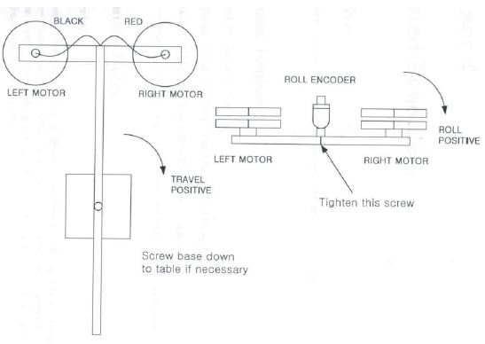
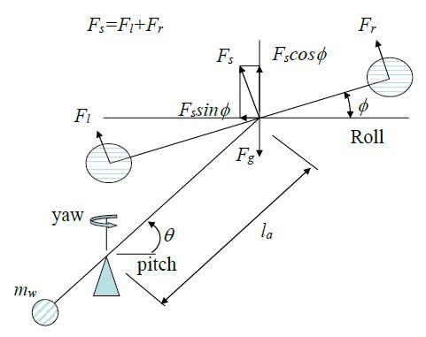

# 3DOF Helicopter

## Objective

The purpose of this experiment is to design an attitude controller for the 3-DOF helicopter mechanism and to test the controller using the real-time experimental setup.

## Equipment Required

* [ ] 3-DOF helicopter mechanism
* [ ] Q8-USB interface board
* [ ] MATLAB, SIMULINK and QUARC software
* [ ] Power module for the PCI Multi-Q board and the helicopter mechanism

![Figure 5.1: 3-DOF Helicopter when running \[Image credit: Lehigh University\]](../.gitbook/assets/heli.JPG)

## Part A: Modeling

### Description of a 3-D Helicopter Mechanism

The 3-DOF helicopter mechanism used in this experiment is shown in Fig. 5.2. The 3-DOF helicopter consists of a base upon which an arm is mounted as shown in Fig. 5.4. The arm carries the helicopter body at one end and a counterweight at the other. It can pitch about a longitudinal axis as well as yaw about a vertical axis. Encoders mounted on these axes allow for measuring the pitch and the yaw of the arm. The helicopter body is mounted at the end of the arm as shown in Fig. 5.4. The helicopter body is free to roll about the arm. The roll angle is measured via a third encoder. Two motors with propellers mounted on the helicopter body can generate a force proportional to the voltage applied to the motors.

.png>)

.JPG>)

The force generated by the propellers can cause the helicopter body to lift off the ground. The purpose of the counterweight is to reduce the power requirements on the motors. All electrical signals to and from the arm are transmitted via a slip-ring with 8 contacts thus eliminating the possibility of tangled wires and reducing the amount of friction and loading about the moving axes.

### Mathematical Model

#### Pitch

.png>)

Consider the diagram in Fig. 5.5. For a zero roll angle, the pitching torque is controlled by the forces generated by the two propellers (i.e. $$F_l+F_r$$ ). The body will not rise until the total force $$F_s = F_l+F_r$$ is greater than the mass differential force $$F_g$$&#x20;

$$
F_g = \frac{l_am_hg-l_wm_wg}{l_a} \tag{5.1}
$$

A sketch of the configuration in 3-D motion is shown in Fig. 5.6. Once the body is in the air with a roll angle ($$\phi$$), the equation for pitch ($$\theta$$) is given by

$$
\begin{equation} \tag{5.2}
\begin{aligned}
  J_{\theta} \ddot{\theta} & = l_a F_s - l_a F_g = l_a(F_l+F_r)\cos\phi - l_a F_g \\
  J_{\theta}\ddot{\theta} &= K_f l_a(V_l+V_r)\cos\phi - T_g \\
&= K_f l_a V_s \cos\phi - T_g
\end{aligned}
\end{equation}
$$

where&#x9;

* $$J_{\theta}$$ : moment of inertia of the body about the pitching  axis&#x9;
* $$K_f$$: force constant of the motor/propeller combination&#x9;
* $$l_a$$ : distance from the pivot point (longitudinal axis) to the propellers
* $$l_w$$ : distance from the pivot point (longitudinal axis) to the counterweight&#x9;
* $$\theta$$ : pitch angle measured in radians (positive in the direction indicated in Fig. 5.5)&#x9;
* $$\phi$$ : roll angle (see Fig. 5.6)
* $$V_r$$ : voltage applied to the right motor resulting in force $$F_r$$&#x20;
* $$V_l$$ : voltage applied to the left motor resulting in force $$F_l$$&#x20;
* $$T_g$$ : Mass differential torque $$= l_a F_g$$&#x20;

#### Roll

.JPG>)

Consider the diagram in Fig. 5.7. The rolling moment is controlled by the difference in the forces generated by the propellers. If the force generated by the right motor is higher than the force generated by the left motor, the helicopter body will roll to left (positive).

$$
\begin{equation} \tag{5.3} \begin{aligned} J_\phi\ddot{\phi} &= F_rl_h-F_ll_h \\ &= K_fl_h(V_r-V_l) \\ &= K_fl_hV_d \end{aligned} \end{equation}
$$

where

* $$J_\phi$$ : mass moment of inertia of the body about the roll axis.
* $$l_h$$ : distance from the roll axis to either motor.
* $$\phi$$ : roll angle measured in radians.

#### Yaw

The only way to apply a force in the lateral direction is to roll the helicopter body. Assume that the body rolled to left (positive) by an angle $$\phi$$ (see Fig. 5.6). The horizontal component of the sum of the rotor forces will cause a torque about the yaw axis which results in a positive yaw acceleration.

$$
\begin{equation} \tag{5.4}
\begin{aligned}
  J_{\psi} \dot{r} & = l_a(F_l+F_r)\sin\phi \\
  &= K_f l_a(V_l+V_r)\sin\phi \\
&= K_f l_a V_s \sin\phi  
\end{aligned}
\end{equation}
$$

​where

* &#x20;$$J_\psi$$ : moment of inertia of the body about the yaw axis.
* $$r$$ : yaw rate in rad/sec.

Equations (5.2), (5.3) and (5.4) mean that the pitching acceleration is a function of the sum of the voltages applied to the motors, the rolling acceleration is a function of the difference in the voltages applied to the motors, and the yaw acceleration is a function of the roll angle.

## Part B: Controller Design

### Pitch Controller

The purpose is to design a controller to control the pitch angle of the helicopter by supplying the appropriate sum of voltage to the motors. We will assume the mass differential torque has been balanced by a constant thrust from the propellers. Assuming the roll angle to be small, we obtain the following linear system

$$
J_{\theta}\ddot{\theta} = K_fl_a(V_r+V_l)=K_fl_aV_s \tag{5.5}
$$

where $$V_s=(V_r+V_l)$$ is the sum of the voltages applied to the motors. First, design a PD controller of the form

$$
V_s =-K_{\theta p}(\theta-\theta_c)-K_{\theta d}\dot{\theta} \tag{5.6}
$$

where $$\theta_c$$ is the commanded pitch angle. With this controller, the closed-loop transfer function for pitch is

$$
\frac{\theta(s)}{\theta_c(s)} = \frac{K_f l_a K_{\theta p}}{s^2J_\theta+K_fl_aK_{\theta d}s+K_fl_aK_{\theta p}} = \frac{\cfrac{K_fl_aK_{\theta p}}{J_{\theta}}}{s^2+\cfrac{K_fl_aK_{\theta d}}{J_{\theta}}s+\cfrac{K_fl_aK_{\theta p}}{J_{\theta}}} \tag{5.7}
$$

The standard form for the transfer function of a second-order system is

$$
\text{Standard }\mathrm{2^{nd}}\text{ order TF form} = \frac{\omega_n^2}{s^2+2\zeta\omega_ns+\omega_n^2} \tag{5.8}
$$

Comparing Eq. (5.7) with Eq. (5.8), and for desired values of closed-loop pitching motion natural frequency ($$\omega_{n\theta}$$) and damping ratio ($$\zeta_\theta$$), we obtain&#x20;

$$
\frac{K_fl_aK_{\theta p}}{J_\theta} = \omega_{n\theta}^2 \qquad \to \qquad K_{\theta p}=\frac{J_\theta\omega_{n\theta}^2}{K_fl_a} \tag{5.9}
$$

$$
\frac{K_fl_aK_{\theta d}}{J_\theta} = 2\zeta_\theta \omega_{n\theta} \qquad \to \qquad K_{\theta d}=\frac{J_\theta(2\zeta_\theta\omega_{n\theta})}{K_fl_a} \tag{5.10}
$$

We can also include an integral term in the controller (PID controller) to compensate for the mass differential torque $$T_g$$.  (Above we assumed that the helicopter was perfectly balanced, i.e., $$T_g = 0$$, but we need $$K_i$$ because it is not balanced in the actual experiment.  Why don’t we balance it to make this easier?  There is a very good reason for it.)

The controller is now

$$
V_s =-K_{\theta p}(\theta-\theta_c)-K_{\theta d}\dot{\theta}-K_{\theta i}\int(\theta-\theta_c)dt \tag{5.11}
$$

We will tune the integral gain $$K_{\theta i}$$ using simulation of the nonlinear system with an initial guess of $$K_{\theta i}=0.01K_{\theta p}$$ .

### Roll Controller

The purpose is to design a controller to control the roll angle of the helicopter by supplying an appropriate difference of voltage to the motors. The open-loop axis equation of motion for roll is

$$
J_\phi\ddot{\phi}=K_fl_h(V_r-V_l)=K_fl_hV_d \tag{5.12}
$$

where

$$
V_d = (V_r-V_l)
$$

We implement a PD controller of the form

$$
V_d = -K_{\phi p}(\phi-\phi_c)-K_{\phi d}\dot{\phi} \tag{5.13}
$$

where $$\phi_c$$ is the commanded roll angle. The resulting closed-loop transfer function is given by

$$
\frac{\phi(s)}{\phi_c(s)} = \frac{K_fl_hK_{\phi p}}{s^2J_\phi+K_fl_hK_{\phi d}s+K_fl_hK_{\phi p}} \tag{5.14}
$$

Similar to the pitch controller, the roll controller gains are determined by comparing the closed-loop system transfer function Eq. (5.14) with the standard form of the transfer function of a second-order system of Eq. (5.8) to obtain

$$
\frac{K_fl_hK_{\phi p}}{J_\phi} = \omega_{n\phi}^2 \qquad \to \qquad K_{\phi p}=\frac{J_\phi\omega_{n\phi}^2}{K_fl_h} \tag{5.15}
$$

$$
\frac{K_fl_hK_{\phi d}}{J_\phi} = 2\zeta_\phi\omega_{n\phi} \qquad \to \qquad K_{\phi d}=\frac{J_\phi(2\zeta_\phi\omega_{n\phi})}{K_fl_h} \tag{5.16}
$$

where $$\omega_{n\phi}$$ and $$\zeta_\phi$$ are respectively the desired natural frequency and damping ratio of the closed-loop rolling motion.&#x20;

### Yaw Controller

The purpose is to design a controller to control the **yaw rate** of the helicopter by commanding a roll angle. We will first assume that the configuration is in equilibrium, i.e., the sum of the rotor forces $$F_l+F_r$$ is nearly equal to the mass differential force $$F_g$$. Note that we will later relax this assumption in the nonlinear simulation. With this assumption, the **linearized** equation for the yaw dynamics is given by&#x20;

$$
J_\psi\dot{r}=F_gl_a\phi \tag{5.17}
$$

In order to achieve a desired yaw attitude rate $$r_c$$, we design a PI controller that commands the desired roll angle $$\phi_c$$ based on a given _yaw rate_ command, as follows:

$$
\phi_c=-K_{rp}(r-r_c)-K_{ri}\int(r-r_c)dt \tag{5.18}
$$

We assume that roll response ($$\phi$$) follows the roll command ($$\phi_c$$) almost instantaneously (note that this assumption has certain implications on how we design roll and yaw control loops). Assuming $$K_{ri} = 0$$, the resulting closed-loop transfer function is given by

$$
\frac{r(s)}{r_c(s)}=\frac{F_gl_aK_{rp}}{J_\psi s+F_gl_aK_{rp}} \tag{5.19}
$$

The standard form for the transfer function of a first-order system is given by

$$
\text{Standard TF of }\mathrm{1^{st}}\text{ Order System} = \frac{1}{\tau s+1} \tag{5.20}
$$

Comparing Eq. (5.19) with Eq. (5.20), and for a desired value of closed-loop yaw rate response time constant, we obtain

$$
\tau = \frac{J_\psi}{F_gl_aK_{rp}} \qquad \to \qquad K_{rp}=\frac{J_\psi}{F_gl_a\tau} \tag{5.21}
$$

Once the proportional gain is determined, we can add the integral term $$\left(K_{ri}=0.01K_{rp}\right)$$ and tune the integral gain $$K_{ri}$$ through nonlinear simulation of the system.&#x20;

### System Parameters

The following are the estimated parameter values for the 3-DOF Helicopter Mechanism.

$$
\begin{equation*}
\begin{aligned}
J_\theta &= 1.1 \mathrm{~kg-m^2}\\
J_\phi &= 0.0469 \mathrm{~kg-m^2}\\
J_\psi &= 1.1 \mathrm{~kg-m^2}\\
l_a &= 0.63 \mathrm{~m}\\
l_h &= 0.18 \mathrm{~m} \\
K_f &= 0.0784 \mathrm{~N/Volt}\\
F_g &= 0.63 \mathrm{~N}
\end{aligned}
\end{equation*}
$$

### Procedure

1.  Design a PID controller for the control of pitch attitude $$\theta$$ and a PD controller for the control of roll attitude $$\phi$$ using the system parameters given above. The closed-loop system must meet the following specifications for a step response:

    1. In pitch:          3 sec < peak time < 3.5 sec,       5% settling time < 5 sec
    2.  In roll:             1.2 sec < peak time < 1.8 sec,     5% settling time < 2 sec

        ****

    **Note:** For a second-order system:

    &#x20;                       $$\text{Peak time} =\cfrac{\pi}{(\sqrt{1-\zeta^2})\omega_n} \qquad \qquad \text{5\% Settling time} = \cfrac{3}{\zeta\omega_n}$$

    Use the following steps to design the pitch and roll controller:

    First, pick a value for the peak time and settling time that falls within the above specifications (**Note:** It is probably a good idea to pick a peak time less than the settling time). Next, using the above equations, calculate the values of the natural frequency $$\omega_n$$ and damping $$\zeta$$. Use Eqs. (5.9) and (5.10) for determining the PD controller gains for the pitch controller. Similarly, use Eqs. (5.15) and (5.16) to determine the PD controller gains for the roll controller. Initially set the integral gain of the pitch controller to a default value of $$K_{\theta i} = 0.01K_{\theta p}$$. We will adjust the integral gain later using nonlinear simulation of the system.  At the end of Step 1, you should have five gains.

    ****

    **Note:** The roll controller is a PD controller, and does not have an integral gain.

2.  Assuming that the roll angle tracks instantaneously, design a PI controller for control of yaw rate $$r$$. The closed-loop system must meet the following specification:

    In yaw rate response: 4 sec < rise time < 5 sec

    ****

    **Note:** For a first-order system, the rise time ($$t_r$$) is related to the time constant ($$\tau$$) by the following relation:

    $$t_r=\tau \ln{9} \tag{5.22}$$                                                              &#x20;

    Pay attention to the assumption above.  The yaw controller works through commanding a roll angle, but for this initial design, we assume that the roll angle matches this command instantaneously.

    Select a value of rise time in the specified range and use Eq. (5.22) to determine the value of time constant ($$\tau$$). Then use eq. (5.21) to determine the proportional gain $$K_{rp}$$. Use a default value of $$K_{r i} = 0.01K_{r p}$$ for the integral gain. We will adjust the integral gain later using nonlinear simulation of the system.

3.  Using Eqs. (5.5) and (5.6), build a SIMULINK model of the closed-loop system for the pitch PID controller and enter the gains you found.  The design that you performed gave you values that should work well, but they are only an initial guess.  You must implement them and test the response to ensure it meets the requirements, and modify the gains if necessary.  Run a closed-loop response to a pitch attitude step command of 20 deg. Plot the response and verify that the response meets the given specifications.  (**Note:** You can test the requirements with this command as well.  You don’t have to use a unit step for testing, because this is a linear system.)

4.  Repeat the above process for roll (i.e., build a PD controller model in SIMULINK using Eqs. (5.12) and (5.13) and enter the gains you found.  Test the roll controller using a roll attitude step command of 10 deg. Plot the response and verify that the response meets the given specifications.&#x20;

5.  Develop the SIMULINK model for the yaw rate controller.  This one is a little different because it does not command motor voltages directly, as the others did.  Instead, for a given yaw rate, the controller commands a roll angle.  Assume $$\phi=\phi_c$$ and use Eqs. (5.17) and (5.18) to build a SIMULINK model. Plot yaw rate and yaw attitude (this is integral of yaw rate) responses to a 10 second pulse yaw rate command of 10 deg/sec and verify that the response meets the given specification. If required, adjust the gains.

6.  We will now add nonlinear terms into the SIMULINK model that were not included as part of the initial system.  The system was linearized because a linear system is easier to analyze and design.  Now, you need to include two nonlinear terms, $$\sin(\phi)$$ and $$\cos(\phi)$$, in your model to make it more realistic. **Look specifically at pitch and yaw dynamics and consider how roll angle affects them. (Figure 5.6 should help you in this)**. Also, you need to include the mass differential torque as a constant input to the pitch dynamics. Further, you need to replace $$F_g$$ by $$F_s$$ in the yaw dynamics. The commanded roll attitude from the yaw controller becomes input to the roll controller, thus coupling the yaw and roll loops. The propeller force $$F_s$$ from the pitch controller is multiplied by $$\sin\phi$$ and therefore $$F_s\sin(\phi)$$ becomes  the input to the yaw dynamics. Likewise, the propeller force $$F_s$$ is multiplied by $$\cos(\phi)$$ , and therefore $$F_s\cos(\phi)$$ becomes the input to the pitch dynamics.

7.  You need to use a unit step input for yaw rate and verify that your yaw controller meets the rise time requirement (adjust yaw gains if required). Then, design a pulse input of 10 deg/sec to simulate a yaw rate command given by the pilot. Integrate yaw rate to obtain yaw attitude. Determine the duration of the pulse input that is needed to achieve a 180 deg turn.  This can be done through trial and error if you like.  Plot the yaw rate and yaw attitude responses.&#x20;

    ****

    **Note**: Since the pitch loop includes the constant mass differential torque, include several seconds (say 50-100 seconds) of simulation with zero commands initially so that the system reaches equilibrium by balancing the mass differential force using the propeller force. Adjust your pitch integral gain $$K_{\theta i}$$ such that the system reaches equilibrium within ​the selected 50-100 seconds limit.

8. Repeat step 7 while simultaneously commanding 20 degrees of pitch attitude and a 10 deg/sec yaw rate pulse of required duration to achieve a 180 deg turn. The input command should be implemented after the equilibrium has reached (in between 50-100 seconds).
9. You need to complete the controller design prior to your lab. Also, you need to complete all simulations at home for inclusion in the group report. Make sure you have: all your gains listed, there should be 7 of them, the pitch angle response, the roll angle response, the yaw rate and angle response, and that all of the requirements are met for all of them, and what pulse duration was needed for the 180-degrees turn for the two cases of with zero pitch attitude and 20 deg pitch attitude.


**Each of you must complete the controller design at home and have the gain values from your design with you when you go to the experiment lab in order to receive lab participation credit. Also, each of you must include your controller designs as part of the lab report to get credit for your work.** **Each of you must complete SIMULINK responses at home and include them in the group report to get credit for your work.**


## Part C: Controller Implementation and Evaluation

### Running the Experiment


Always stay clear of the helicopter while running and catch it while stopping.


### **Experimental Setup**


Check and ensure that the counterweight in the secondary arm is fixed in the furthest hole/position away from the rotors.


#### Pitch and Roll Control

1.  Turn the power on.

2.  Open the MATLAB and locate the file **Helicopter\_PitchRoll\_PID.mdl** under the path **C:\AE4610\_Controls\_Lab\Helicopter** and open it. This is the block diagram for this part of the experiment.

3.  To build the model, click the down arrow on **Monitor & Tune** under the Hardware tab and then click **Build** **for monitoring** .png>). This generates the controller code.

4.  Set the PID gains in the Pitch Controller and PD gains in the Roll Controller blocks in the Simulink diagram from Part B Step 3 and 4.

5.  Double click the Pitch Command block to open it and change the gain after the Pitch(step) input to 0.

6.  Double click the Roll Command block to open it and change the gain after the Roll(step) input to 0.

7.  Hold the helicopter in a level position before starting the experiment until the fans are in full power.

8.  Press **Connect**  button under Monitor & Tune and then press **Start** . Check if the controller can maintain the attitude of the helicopter.

9.  Double click on the scopes and open them.

10. Gently **disturb** the helicopter to see the effect of the controller.

11. Double click the Pitch Command block to open it and change the gain after the Pitch(step) input to 1 and run the experiment from the level position.

12. **Save the data** with a descriptive name such as pitch\_command. After saving the data, clear the workspace using the clear command in MatLab window.

13. Double click the Pitch Command block to open it and change the gain after the Pitch(step) input to 0.

14. Double click the Roll Command block to open it and change the gain after the Pitch(step) input to 1 and run the experiment from the level position.

15. **Save the data** with a descriptive name such as roll\_command. After saving the data, clear the workspace using the clear command in MatLab window. Close the Simulink model. **DO NOT SAVE THE MODEL**.

#### Pitch, Roll, and Yaw Control

1.  Open the MATLAB and locate the file **Helicopter\_PitchRollYaw\_PID.mdl** under the path **C:\AE4610\_Controls\_Lab\Helicopter** and open it. This is the block diagram for this part of the experiment.

2.  To build the model, click the down arrow on **Monitor & Tune** under the Hardware tab and then click **Build** **for monitoring** .png>). This generates the controller code.

3.  Set the PID gains in the Pitch Controller, Roll Controller, and Yaw Rate Controller blocks in the Simulink diagram.

4. Double click the Pitch Command block to open it and change the gain after the Pitch(step) input to 0.
5.  Double click the Yaw Rate Command block to open it and change the gain after the Yaw(step) inputs to 1.

6.  Hold the helicopter in a level position before starting the experiment until the fans are in full power.

7. Press **Connect**  button under Monitor & Tune and then press **Start** .
8. **Save the data** with a descriptive name such as nonlinear\_yaw. After saving the data, clear the workspace using the clear command in MatLab window.
9. Turn the POWER OFF.

### Analysis

1.  Compare the actual responses with the simulated responses from Part B. Comment on the differences in the responses.

2.  Give a reason why it is better to design a yaw _rate_ controller instead of a _yaw attitude_ controller.&#x20;

3. Comment on what one would expect if one were to design the yaw controller rise time to be of the same or less than that of the roll controller.

## Group Lab Report

Include the controller designs, the SIMULINK block diagrams, and the responses from each member of the group clearly marked by the student’s name. Include a controller evaluation section and answer the analysis questions. Make certain that for the analysis, you compare the differences between experimental and simulation responses.  There should be a lot to talk about, as this experiment has a lot of variables and non-linear influences.  Discuss any discrepancies you observe and any logical reasons for why they exist.&#x20;

