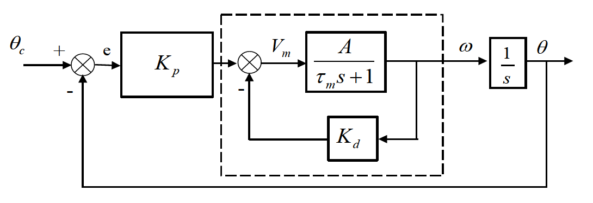
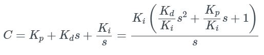

# DC Motor

## Objective

This laboratory experiment is designed to give the students a clear understanding of a typical DC motor control system. DC motors are used in typical flight control systems to actuate various devices (ailerons, flaps, elevator, rudder, etc). The experiment is divided into three parts:

#### Part A deals with modeling of a DC motor.

#### Part B includes the design of a position control system for the motor.

#### Part C involves implementation and evaluation of the controller designed in Part B. &#x20;

.png>)

## Part A: Modeling

Any control problem consists, in general, of three main phases: The first phase is modeling/system identification, the second phase is controller design, and the third phase is controller implementation, testing and evaluation. This part of the experiment involves the first phase, namely, system identification and modeling of a DC motor. Identification of a complex system can be very challenging; however, for some systems, it may be possible to find a simple model that is suitable for control design. The objective of Part A of this experiment is to find the parameters of the reduced model for the DC motor used in the lab. This process yields a transfer function description of the DC motor system that can be used to design a controller for the DC motor.

### DC Motor

A picture of the DC motor set in the lab is shown in Fig. 2.1. Figure 2.2 is a schematic of a typical DC motor. The motor is made up of a rotor and a stator. The stator windings create a magnetic field of intensity $$\Phi _f$$. In a _permanent magnet DC motor_ (of the same type used in the lab) the stator is made of magnetic material and there is no field winding.

The rotor is made up of a set of armature windings and a commutator. The commutator is used to energize an individual winding when that winding is perpendicular to the stator field. That causes the magnetic field of the armature $$\Phi _a$$ to be always perpendicular to the field of the stator. This results in maximum torque for a given armature current. In general, the motor torque is proportional to the product of field intensities

$$
T_m = k_1 \Phi _f \Phi_a
$$

The armature field intensity is proportional to the armature current $$i_a$$. Hence, $$\Phi _a = k_2i_a$$, and since the stator field intensity $$\Phi_f$$ is constant, it follows that

$$
T_m = K_mi_a \tag{2.1}
$$

where $$K_m = k_1\Phi_f k_2$$ .

When the armature winding rotates in a magnetic field, a back voltage, $$V_b$$ (back electromotive force (EMF) voltage) is generated that is proportional to the rate of change of the flux passing through the winding, and hence, it is also proportional to the rotor speed. Therefore, it follows that

$$
V_b = K_b\omega
$$

A schematic of the electrical and mechanical parts of the motor are shown in Fig. 2.2.

.png>)

From the electric circuit of the armature we have

$$
V_m = L\frac{di_a}{dt} + Ri_a + V_b \tag{2.2}
$$

For the mechanical part of the motor we have

$$
T_m - T_d - B\omega = J\frac{d\omega}{dt} \tag{2.3}
$$

where

* $$L$$ : armature inductance
* $$i_a$$ : armature current
* $$R$$ : armature resistance
* $$V_b$$ : back EMF voltage
* $$V_m$$ : voltage applied to the motor
* $$J$$ : total inertial (rotor and load)
* $$T_m$$ : motor torque
* $$T_d$$ : disturbance torque
* $$B$$ : damping coefficient due to friction
*   $$\omega$$ : angular velocity of the motor

The Laplace transform of (2.2) and (2.3) yields

$$
V_m(s) = (sL + R)i_a(s) + V_b(s)  = (sL + R)i_a(s) + K_b\omega(s) \tag{2.4}
$$

and

$$
T_m(s) - B\omega(s) - T_d(s) = sJ\omega(s) \tag{2.5}
$$

and using (2.1) we get

$$
K_mi_a(s) - T_d(s) = (sJ + B)\omega(s)
$$

Combining (2.4) and (2.5) and _assuming negligible disturbance torque_, one obtains that

$$
\frac{\omega(s)}{V_m(s)} = \frac{K_m}{(R+Ls)(B+Js) + K_mK_b}
$$

$$
\frac{\omega(s)}{V_m(s)} = \frac {K_m} {LJs^2 + (LB + JR)s + RB + K_m K_b} \tag{2.6}
$$

Often, L ≈ 0 and B ≈ 0. In this case, the transfer function in (2.6) simplifies to

$$
\frac{\omega(s)}{V_m(s)} = \frac{K_m}{JRs + K_mK_b} = \frac{1/K_b}{\tau_m s + 1} \tag{2.7}
$$

where,

$$
\tau_m = \frac{JR}{K_mK_b} \space \text{is the \textbf{time constant} of this first-order system.}
$$

Figure 2.3 below shows a block diagram representation of the DC motor system.

.png>)

It is of interest to note that $$K_m$$ is related to $$K_b$$. This can be shown by considering the power balance in steady state. The power input to the motor is

$$
P_{in} = V_bi_a = K_b\omega i_a
$$

The power delivered to the shaft is&#x20;

$$
P_{out} = T_m\omega = K_m \omega i_a
$$

Equating the previous two expressions yields that $$K_m = K_b$$. (Note that the above relationship is based on the assumption that the same units are used for both $$P_{in}$$ and $$P_{out}$$.)

The transfer function for the DC motor as derived in (2.7) and as shown in Fig. 2.3 is

$$
\frac{\omega (s)}{V_m(s)} = \frac{K_m}{JRs + K_mK_b} = \frac{1/K_b}{\tau_m s +1} \tag{2.8}
$$

where

$$
\tau_m = \frac{JR}{K_b^2} \tag{2.9}
$$

since $$K_m = K_b$$&#x20;

The DC gain of the system is calculated by evaluating (2.8) at $$s = 0$$. Hence

$$
\text{DC} \space \text{Gain} = \frac{1}{K_b} \space \text{[(rad/sec) / volt]} \tag{2.10}
$$

Thus, we have reduced the DC motor to a first-order system as shown in Fig. 2.4. The theoretical values of the DC gain and time constant ($$\tau_m$$) are given by (2.9) and (2.10). The DC gain and time constant values can also be determined experimentally, as shown in the next section.

.png>)

### First-Order System Response to a Step Input

The DC gain and the time constant value of the DC motor can be determined by subjecting the motor to a step voltage input. Typical first-order system response to a step input is illustrated in Fig. 2.5. **The DC gain is obtained by dividing the steady-state value of the output by the magnitude of the input step.** Recall that from the final value theorem

$$
y_{ss} = \lim_{t \to \infty}y(t)  = \lim_{s \to 0}sY(s)
$$

.png>)

The time constant $$\tau_m$$ is the time at which the output reaches 63.2% of its steady-state value.

### Procedure&#xD;

1. With the help of the TA, check and ensure that the Quanser QUARC software is linked to MATLAB. QUARC is the MATLAB plug-in that enables communication with the hardware interface boards manufactured by Quanser.\

2. In the MATLAB directory navigation bar, go to **C:\Users\Public\AE4610\DC Motor\DCMotor**. Locate the file **DCMotor\_OL.mdl** under the Current Folder section and open it. This is the block diagram for this part of the experiment.\

3.  To build the model, click down arrow on **Monitor & Tune** under Hardware tab and then **Build** **for monitoring** .png>). This generates the controller code in the MATLAB window. If you encounter build issues, this is usually due to file permission conflicts caused by having multiple users share the same files. To resolve this, have the TA help you create a clean installation by deleting the DC Motor folder and unzipping the backed up "DC Motor - Unzip Me For Clean Install" folder (be sure to recover any stored data in the original folder before deleting).

4.  Open the scope **Theta\_dot**.

5.  Turn on the power supply.

6.  For the braked position of the magnetic brake (1 position), choose 3 different input voltages (< 5 volts).&#x20;

7.  Press **Connect**  button under Monitor & Tune and then press **Start** . Run the motor with a step input of the selected input voltage for 10 seconds.

8.  Save the data by selecting all the data in the MATLAB window, right click and select **Save as**, go to the folder **C:\Users\Public\AE4610\DC Motor\Lab Data\<Your group number>** and save the motor angular velocity data with different names. For example, `DCMotor_OL_Data_3V.`&#x20;

9.  Repeat steps 8, 9 for all the three step inputs.

10. Run the motor for 10 seconds for sinusoidal voltage input. Select the amplitude (< 5 volts) and frequency (< 5 rad/s). Save the data.

11. Data will be uploaded on Canvas by the TA. **DO NOT DELETE THE SIMULINK MODEL**. Close Simulink and **DO NOT SAVE**.&#x20;

### Analysis

1.  Plot the measured angular velocity of the DC motor vs. time for each step input.  From the plot, determine the time constant and the DC gain of the DC motor as described in the above section.

2.  Average the DC gain and time constant for the three different input voltages to get a single value of the DC gain and time constant.

3.  Build a SIMULINK model that represents the DC motor model obtained experimentally (see Fig. 2.4). Use the time constant and DC gain from Step 2.

4. Simulate the sinusoidal input used in Step #11 of the Procedure in your SIMULINK model and compare the output with the experimental angular velocity obtained in the experiment. Plot the simulated and experimental angular velocity responses on the same plot. Make sure to label each response. Explain any differences in the responses (very briefly, in a couple of sentences).

## Part B: Controller Design

### Objective

The objective of Part B of the DC motor experiment is to design a position control system for the motor to meet a given set of specifications.

### Equipment Required

*   [ ] PC

* [ ] MATLAB and SIMULINK software

### Experiment Notes

Now that we have identified the time constant and the DC gain for the system in the modeling part of this experiment, the next step is to design a position control system in order to convert the given DC motor into a _position servo_. A classical PID controller will be used to control the position of the motor subject to a given set of specifications, for example, bandwidth, steady-state error requirements, etc.

Recall that the transfer function of the motor from $$V_m$$ to $$\omega$$ in (2.8) is approximated as

$$
\frac{\omega(s)}{V_m(s)} = \frac{1/K_b}{\tau _m s +1}
$$

#### Proportional (P) Control

Since $$\dot{\theta} = \omega$$, where $$\theta$$ is the angular position of the motor, the transfer function from the applied voltage to the motor angular position is

$$
G(s) = \frac{\theta (s)}{V_m (s)} = \frac{1/K_b}{s(\tau _ms + 1)} = \frac{A}{s(\tau _ms+1)} \tag{2.11}
$$

where $$A = 1/K_b =$$ DC Gain of the motor.

The block diagram of a DC motor with a proportional controller is shown in Fig. 2.6. In this case, the controller transfer function ($$H$$) is a simple gain $$K_P$$. From Fig. 2.6, the closed-loop transfer function from the commanded angular position $$\theta_c$$ to the actual angular position $$\theta$$ is given by

$$
\frac{\theta(s)}{\theta_c(s)} = \frac{AK_p}{\tau_m s^2 + s + AK_p} = \frac{\cfrac{AK_p}{\tau_m}}{s^2 + \cfrac{1}{\tau_m}s + \cfrac{AK_p}{\tau_m}}
$$

Comparing the above transfer function to the standard form for a second-order system, i.e.,

$$
\frac{\theta(s)}{\theta_c(s)} = \frac{\omega_n^2}{s^2 + 2\zeta \omega_n s + \omega_n^2}
$$

we notice that the proportional gain $$K_p$$ affects the natural frequency (and hence the bandwidth) of the closed-loop system.

.png>)

####

#### Proportional-plus-Derivative (PD) Control

The block diagram of a DC motor with an inner loop angular rate (i.e., derivative) feedback and an outer loop angular position error (proportional) feedback is shown in Fig. 2.7. From Fig. 2.7, the closed-loop transfer function from the commanded angular position $$\theta_c$$ to the actual angular position $$\theta$$ is given by

$$
\frac{\theta(s)}{\theta_c(s)} = \frac{AK_p}{\tau_m s^2 + (1 + AK_d)s + AK_p} = \frac{\cfrac{AK_p}{\tau_m}}{s^2 + \cfrac{(1 + AK_d)}{\tau_m}s + \cfrac{AK_p}{\tau_m}}
$$

Comparing the above transfer function with the standard form for a second-order system, we notice that the derivative gain $$K_d$$ affects the damping while the proportional gain $$K_p$$ affects the natural frequency of the closed-loop system.

#### Proportional-plus-Integral-plus-Derivative (PID) Control

The block diagram of a DC motor with an inner loop angular rate (i.e., derivative) feedback and an outer loop angular position error plus integral of angular position error (i.e., proportional plus integral) feedback is shown in Fig. 2.8.&#x20;

.png>)

From Fig. 2.8, the open-loop transfer function $$GH$$ becomes

$$
GH = \frac{(K_ps+K_i)}{s} \frac{A}{(\tau_ms+1+AK_d)}\frac{1}{s}
$$

indicating that with integral feedback, the type of the system increases from 1 to 2 and hence, results in zero steady-state error to both ramp and step command inputs.&#x20;

#### Sampling Time

The most important difference between analog and digital control is that digital systems operate using a clock. The timing of this clock and the number of operations necessary to implement a controller place a limit on how frequently the controller can access sensors, make calculations, and modify the control inputs. (In addition, other elements of the control system themselves may introduce an additional time delay. For this reason, the sampling time $$T_s$$ of the digital system is an important parameter.) Digital controllers, in general, will have a maximum $$T_s$$. Increasing the $$T_s$$ further will make the closed-loop system unstable.

### Design Specifications

The closed-loop DC motor system must meet the following specifications.

1.  **Bandwidth frequency of at least 10 rad/sec** (Bandwidth is an important measure of the frequency range over which the system output follows well the command signal. **It is defined as the frequency at which the magnitude ratio is -3 dB in the closed-loop system frequency response plot**. Sinusoidal inputs with frequencies less than the bandwidth frequency are tracked ‘reasonably well’ by the system.)

2.  **Phase margin of at least 60 deg**. (Gain and phase margins are stability margins to accommodate model variations. A flight control system actuator is typically subject to varying load, resulting in model variations. Hence, it is important to design a controller with sufficient stability margins to accommodate such variations and other effects such as wear with usage.)

3. **Zero steady-state error to both step and ramp commands**.&#x20;

### Procedure

1.  Using the model you have obtained from the prelab, input the transfer function $$G(s)$$ (equation (2.11)) into MATLAB.

2.  First consider a proportional controller, i.e., `C = Kp`. Input `C = 1` into MATLAB.

3.  Run `controlSystemDesigner(G,C)` (you can alternatively run `rltool(G,C)` for versions R2020b and older). Select ‘New Plot -> New Step’  to launch the step response plot (if it is not automatically launched). In the time response plot, only the ‘closed loop: r to y' (blue plot) should be visible. Always do this in all the labs. Select ‘New Plot -> New Bode’ and choose the appropriate option to launch the closed-loop Bode plot. In the closed-loop Bode response window, select the magnitude plot only and readjust the magnitude plot limits to -5 dB and 0 dB under properties and limits. The bandwidth frequency (defined above) can be read from the closed-loop Bode plot. It may be useful to add a grid to the bode plot.&#x20;

4.  In **Control System Designer** or **rltool**, select ‘Open-loop Bode’ under ‘Tuning Methods -> Bode Editor’. The phase margin (PM) of the system can be read off the open-loop bode plot.

5.  Change the controller gain by double-clicking ‘C’ under ‘Controllers and Fixed Blocks’ or by using your cursor on the root locus and check if all the design specifications can be met using a proportional controller, which would be optimal from a design standpoint. If not, at least select a value of $$K_p$$ such that bandwidth is more than 10 rad/sec. Save the root locus, open and closed-loop Bode, and time response plot. Save the gain $$K_p$$ that you used.

6.
    Consider a proportional and derivative controller. In the compensator editor window under ‘C’, add a zero around –10. Using the cursor or manually input values, adjust the zero location of the controller and readjust the proportional gain (if necessary) such that, at least, the bandwidth and phase margin specifications are met.  (Note that with a PD controller for this system, the open-loop transfer function $$GC$$ is still of Type 1. Hence, the zero steady-state error specification for ramp input cannot be met with a PD controller.) Save the root locus, open and closed-loop Bode and time response plot.
    &#x20;\
    \
    The compensator transfer function in **Control System Designer** or **rltool** in this step is of the form shown below. Use it to determine the gains $$K_p$$ and $$K_d$$. Save these gains.\
    \
    &#x20;                                                                                                       \

    **IMPORTANT**: What is the difference between Fig. 2.7 and the control structure that you now have in **Control System Designer** or **rltool**?  They are not identical. $$K_d$$ is multiplied by the derivative of the $$\Theta$$ error signal in **Control System Designer** or **rltool**, yet it is multiplied directly by $$\omega$$ in Fig. 2.7.  Why is this acceptable when dealing with a step input?  Is there a way to mimic this structure exactly in **Control System Designer** or **rltool**?  (If you attempt to change it, make certain you modify the rest of these instructions carefully to achieve the correct results.)

7. Consider a PID controller. Using $$K_p$$ and $$K_d$$ values you have obtained from the previous steps, edit the compensator (i.e. add poles and zeros to match the format below) to include integral feedback with the integral gain set to a small value (i.e., $$K_i$$ is roughly 0.05).  The controller transfer function for this step is\
   &#x20;                                                   \

8.  Readjust the proportional and derivative gains (if necessary, by modifying the zeros, not the overall gain, $$K_i$$) such that bandwidth and phase margin specs are met.&#x9;

9.  Save the root locus plot, open and closed-loop system Bode plots, and time response plot as graphs. Also, save your gains (you must convert from the **Control System Designer** or **rltool** compensator format, back to our conventional gain representation – $$K_p$$ , $$K_d$$ , $$K_i$$).

10. Using the controller you have designed, obtain the closed-loop transfer function and save your result. (Do this in MATLAB using the transfer function variables of $$G$$ and $$C$$ , or export the closed-loop transfer function from **Control System Designer** or **rltool(T\_r2y)**, using the ‘Export’.) (May be listed as ‘IOTransfer\_r2y’). In MATLAB, change the exported state space into a transfer function using `tf(IOTransfer_r2y)`

11. Obtain poles of the closed-loop system. Compute the natural frequency and damping of the dominant poles of the closed-loop system. You can do all this from your exported transfer function using the function `damp()`. Save your results.

12. Construct a SIMULINK diagram using Fig. 2.8 as a guide. However, do not use a transfer function block for anything but the plant. (This allows you to modify your gains easily when necessary.)  Include the controller gains from your design. Save your Simulink model for further use in Part C of the experiment.

13. Run the responses to a unit ramp input first with a PD controller (by setting `Ki = 0`) and then with a PID controller (`Ki = 0.05`). Run the simulation for about 30 sec.&#x20;

14. Make comparison plots of ramp responses with PD and PID controllers (on the same plot) to show any differences between the two responses, especially in steady-state response (i.e., for t>>0). The difference can be more easily spotted by plotting the error variable (i.e. error between the commanded position and the actual position) for each controller. Save the comparison plot and error plot.


You must have your work checked out by one of the TAs before leaving the lab to get credit for your work.


## Part C: Controller Implementation & Evaluation

### Objectives

The objective of this part of the DC motor experiment is to implement the controller designed in part B and evaluate its performance.

### Equipment Required

The following is a list of the required equipment to perform this experiment:

*   [ ] Q8-USB or Q2-USB interface board

*   [ ] MATLAB and SIMULINK software

* [ ] DC Motor

### Controller Implementation

1. With the help of the TA, check and ensure that the Quanser QUARC software is linked to MATLAB.\

2. In the MATLAB directory navigation bar, go to **C:\Users\Public\AE4610\DC Motor\DCMotor**. Locate the file **DCMotor\_CL.mdl** under the Current Folder section and open it.\

3. _**P Controller Test**_: To understand the behaviour of a Proportional controller, implement a P controller by typing the values for $$K_d$$ and $$K_i$$ to 0 in the command window. Set $$K_p$$ as 10.\

4.  To build the model, click down arrow on **Monitor & Tune** under Hardware tab and then **Build** **for monitoring** .png>).&#x20;

5.  Open the _**Theta Command**_ block and make sure that the Final value is equal to **5/Kp**. This will limit the input to the motor to be less than a preset limit of 5 volts.

6.  Open the scope _**Theta**_.

7.  Turn on the power supply.

8.  Press **Connect**  button under Monitor & Tune and then press **Start** . Run the motor with a step input of the selected input voltage for 10 seconds.

9.  Save your data.

10. _**PD Controller Test**_: By introducing a derivative gain ($$K_d$$), notice how the system characteristics change. Set $$K_p$$ to 1 and $$K_d$$ to 2. Observe the behaviour and save the data.

11. _**PID Controller**_: Open the controller block and change the current values of $$K_p$$, $$K_d$$ and $$K_i$$ to match with your controller from Part B.

### Controller Evaluation

1.  Make sure that the magnetic brake position of the DC motor is in braked position (Position 1).  Run the motor with a step input of the selected input voltage for 10 seconds and save the data.

2.  Repeat Step 1 with the magnetic brake set in other positions (position 0 or 2). Save the data (i.e. filename “dccloopoffdesign”).

3.  Repeat Step 1 with the magnetic brake in the original position (position 1) and the sampling time set to 0.1 sec. To set the sampling time, you need to go to the block diagram file, choose “Simulation” -> “Model Configuration Parameters” -> “Solver”. Set the fixed step to 0.1 sec. (It should have been 0.01 previously.) Save the data (i.e. filename “dccloopslowsampling”).

4. Email the data to yourself and delete the data files. **DO NOT DELETE THE SIMULINK MODEL**. Close Simulink and **DO NOT SAVE.**&#x20;

## Analysis

1.  Run a nominal case simulation using your SIMULINK model from Part B, setting the command input to the value you used during the experiment.  Compare the simulation results with corresponding experimental results for the nominal case and explain any differences between those results.

2.  Compare the simulation results for the nominal case with the experimental results for the off-design case and explain any differences.&#x20;

3.  Modify the SIMULINK model to include a zero-order hold block at the input (labeled as $$V_m$$ in Fig. 2.8) to the DC motor in order to account for the effect of the sampling time used in the experiment. (Note this is different from the quantization error introduced by the digital encoder in measuring the angular position). Save this block diagram for inclusion in your lab report.

4.  Run simulations with the zero-order hold set to 0.01 sec and 0.1 sec and save simulation outputs.

5.  Compare the simulation output with a zero-order hold of 0.01 sec to the nominal case experimental results and explain any differences between this comparison and your initial nominal case simulation/experimental comparison.

6. Compare the simulation output with a zero-order hold of 0.1 sec to the slow sampling experimental results and explain any differences.

## Lab Report

*   Include a brief synopsis of what you did in Part A, all the individual controller design work from Part B, and all your work from Part C, namely all of the plots and comparisons asked for. There is no need to repeat the lab manual, so do not spend time entering equations unless you directly used them at some point in your work.

*   Include the analysis questions from Part A.

* Include the following in your Part C analysis section:
  * Effect of proportional controller gain on closed-loop system behavior
  * Effect of derivative controller gain on closed-loop system behavior
  * Effect of integral controller gain on closed-loop system behavior
  * Effect of sampling time on closed-loop system behavior
  * Controller performance in off-design conditions
