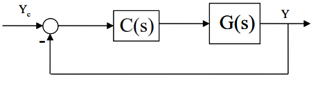
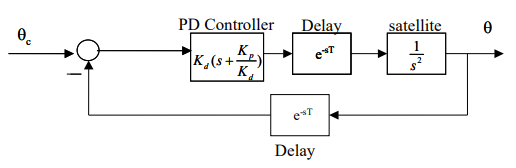
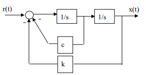
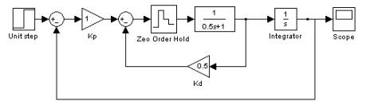
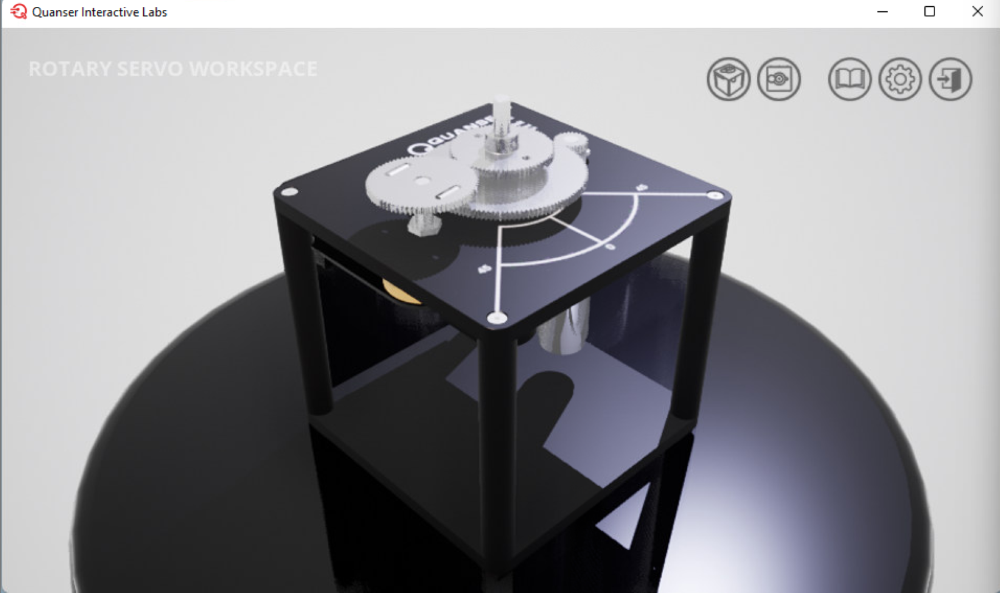
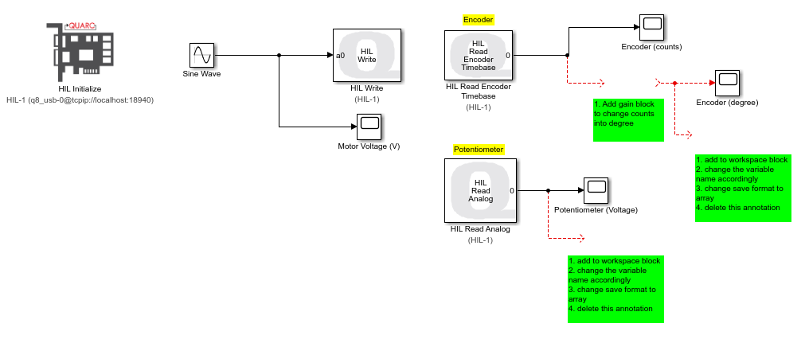

# Lab 0: MATLAB, SIMULINK & Quanser


Before starting the MATLAB & SIMULINK section, please first visit the Quanser Academic Portal at [https://portal.quanser.com/Accounts/Register](https://portal.quanser.com/Accounts/Register) and use your Georgia Tech (<mark style="color:blue;">@gatech.edu</mark>) email to register and activate your account. This could take a day for the system to register your account.



<mark style="color:red;">**Important Note**</mark><mark style="color:red;">:</mark> **Georgia Tech honor code** applies to this and all other experiments in this course. Ask the TAs or the instructor for help if you have any questions on these problems.



<mark style="color:red;">**Important instructions for Lab 0 report**</mark>: There is no need to prepare Lab 0 report using the specified lab report format. Just do it as homework, individually. Submit your work as a **single pdf file** online by the deadline. Begin **each problem** on a **new sheet** and answer the problems in order.\
\
Make sure to do the following: \
(i) **Include all your work** for each problem. If not, your work will not be graded and you will receive a zero. \
(ii) In **each** **plot**, include figure **label, axes labels** with **units**, **legend, etc**. \
(iii) Use a **text font** of at least **10** in all your **plots** and **SIMULINK diagrams**. \
(iv) Use **different line types** in case of **multiple lines** in the **same plot** and **use** a **legend** to clearly identify individual lines. \
(v) **Include** your **MATLAB scripts** and **SIMULINK block diagrams** in your report.


## MATLAB & SIMULINK


It is <mark style="color:orange;">**critical**</mark> that you read following two pdf files to know how to use **MATLAB** and **SIMULINK** to perform well in this course.







### Problem 1 (10 points)

The longitudinal dynamics of an aircraft at a speed of 180 ft/sec is given as

$$
\begin{bmatrix}
\dot{u} \\
\dot{w} \\
\dot{q} \\
\dot{\theta}
\end{bmatrix} = 
\begin{bmatrix}
-0.02 & 0.1 & 0 &-32.2\\
-0.040& -0.8 &180 & 0\\
0&-0.003&-1.0&0\\
0&0&1&0
\end{bmatrix}
\begin{bmatrix}
u \\
w \\
q\\
\theta
\end{bmatrix}
+
\begin{bmatrix}
0\\-8\\-4\\0
\end{bmatrix}
\delta_e
$$

&#x20;    where;\
&#x20;            u     change in longitudinal velocity from trim, ft/sec\
&#x20;            w    change in z-axis component of velocity, ft/sec\
&#x20;            q     pitch rate, rad/sec\
&#x20;            $$\theta$$    change in pitch attitude, rad\
&#x20;            $$\delta_e$$   change in elevator deflection, rad


To Input this to MATLAB, type or copy and paste the following commands:&#x20;


```matlab
A = [-0.02 0.1 0 -32.2 ; -0.040 -0.8 180 0 ; 0 -0.003 -1.0 0 ; 0 0 1 0] 
B = [ 0; -8; -4; 0] 
C = [0 0 0 1] 
D = 0
```


Answer the following questions. For Problem 1, a printout of your MATLAB script with the answers written in the script using comments is acceptable. Attach the plots that are asked.

(i) Find the eigenvalues and eigenvectors of the system matrix.&#x20;


_In MATLAB, use `[V,D] = eig(A)to` return diagonal matrix `D` of eigenvalues and matrix `V` whose columns are the corresponding right eigenvectors, so that `A*V = V*D`._



(ii) Obtain the transfer function between the pitch attitude and the elevator control input.&#x20;


_In MATLAB, use \[num,den]=ss2tf(A,B,C,D). num is the numerator of the transfer function, and den is the denominator. Then, to get a Transfer function, type G1=tf(num,den)._&#x20;



(iii) Obtain the poles of the transfer function of part (ii). Compare the poles of the transfer function with the eigenvalues of part (i).&#x20;


_There are several ways to do this. One way is by typing zpk(G1). You get a transfer function in gain/zeroes/poles format. You can also type \[z, p, k] = zpkdata(G1), which gives vectors containing zeroes (z), poles (p) and gains (k). Another is using the function pzmap(). Type ‘help pzmap’ to learn how it works._



(iv) Convert the transfer function of part(ii) to the state space representation and compare your answer with the given form of the state space model. Explain any differences.&#x20;


_Conversion from TF to SS is done using \[A2, B2, C2, D2] = tf2ss(num,den). Explain the difference (if any) between the state space model you get in this step and the given state space model. (Hint: State space models are not unique)_&#x20;



(v) Using the transfer function of part (ii), obtain frequency response plots (Bode plots). Type bode(G1). You get the Bode plot.&#x20;


(vi) Plot the pitch attitude and pitch rate responses to a step elevator input of 0.02 rad.


_Remember that the C matrix of the system used so far implied that θ is the only output. To plot the response of both q and θ, C should be modified to: C= \[0 0 1 0; 0 0 0 1]. Then, D becomes \[0 ; 0]. Now, the new system can be defined by: G3 = ss(A,B,C,D) . Then, get the response to a step input of 0.02 rad using step(0.02\*G3)._



### Problem 2 (10 points)

​Consider the following block diagram of a feedback control system:



Given $$G(s) = \displaystyle{\frac{2}{s(s+1)(s+3)}}$$ design a lead compensator:

$$
C(s) = K \frac{s+a}{s+b}
$$

where b > a >0, such that the **phase margin is 50**$$°$$, **the** **gain margin is not less than 8 dB**, and the static velocity error constant **Kv** is **0.6**$$\mathrm{s}^{-1}$$. Your final answer should have the desired values of K, a and b. Plot the unit step response of the closed-loop system.


Similar to Problem 1, input the transfer functions G and C to MATLAB by typing: \
G=tf( \[2] , \[1 4 3 0] ) \
C=tf( \[1 0.5] , \[1 1] ) \
Alternatively, the following commands can be used. \
s=tf(‘s’)\
G=2/(s\*(s+1)\*(s+3))\
C=(s+0.5)/(s+1)




Note that arbitrary initial values were chosen for a and b, and K was taken to be unity. Launch the Control System Designer using: controlSystemDesigner(G,C) \[all MATLAB versions] or rltool(G,C) \[only MATLAB R2020b or older]. Under the Control System tab, select "Tuning Methods", and subsequently choose the "Bode Editor" located under the "Graphical Tuning" section. Then, in the field "Select Response to Edit", choose "**LoopTransfer\_C**" which corresponds to the **open-loop transfer** function and click "Plot". You should see in front of you, the **root locus**, and the **Bode plot**. Now try adjusting the pole and zero locations of the compensator C on the root locus. Note that the Control System Designer uses the controller transfer function in the form K1(τ1s+1)/(τ2s+1), which is displayed on the screen. Hence, the velocity error constant for this system is

\
&#x20;                               $$K_v = \lim_{x \to 0} sG(s) C(s) = \displaystyle{\frac{2K_1}{3} }$$\
\
Hence $$K_1$$is specified. When you change the locations of the pole and zero of the controller (using the cursor), you will observe that the gain and phase margins change in the Bode plot. Adjust the pole and zero locations to achieve the required design criteria. Once the desired criteria are achieved, you will need to convert the Control System Designer compensator C which is of the form $$K_1 (\tau_1 s +1)/(\tau_2 s +1)$$to the form $$K (s+a)/(s+b)$$to get $$K, a,~\text{and}~b$$. \
\
To plot the closed-loop system response to step input (if it does not automatically open when Control System Designer is launched), go to the "Data Browser" window, and under "Responses", click on "IOTransfer\_r2y". Then, right-click on it and select "plot" -> "step". \
\
Alternatively, you can go to the "Analysis" section in the top menu bar, click on "New Plot" and select "New Step". Then, in the "Select Response to Plot" field, choose "IOTransfer\_r2y" and click "Plot". Print the Bode, root locus, and time response plots.


### Problem 3 (10 points)

An engineering laboratory has presented a plan to operate an Earth-orbiting satellite that is to be controlled from a ground station. A block diagram of the proposed system is shown in the figure. It takes T seconds for the signal to reach the spacecraft from the ground station and an identical delay for the return signal. The proposed ground-based controller is a proportional-derivative (PD) controller. \
\
Assume no transmission delay (i.e., T=0), and design a controller to the following specifications: \
&#x20;       (1) percent overshoot of **10%** to a **unit step** input \
&#x20;       (2) time to peak roughly at **2.5 sec** to a **unit step** input. \
\
(i) Compute the closed loop system damping ratio and natural frequency and phase margin with the controller in the loop but assuming a zero transmission time delay. \
\
(ii) Estimate the amount of allowable time delay for a stable system from the phase margin calculation.




Similar to Problem 2, launch Control System Designer, with $$G(s) = 1/ s^2$$ , and $$C(s) = K_d(s+K_p / K_d)$$, using an arbitrary value for$$K_p/K_d$$, for example $$K_p/K_d = 1.$$




Note that the Delay blocks reduce to unity at this point. In Control System Designer, choose "IOTransfer\_r2y". To plot the step response, right click on "IOTransfer\_r2y" and choose "plot" -> "step". A step response will be plotted. You can right-click on the graph, and choose “Characteristics” -> “Peak Response” to read the peak value (and thus the percent overshoot) and time to peak directly off the graph. \
\
Now adjust the value of the gain and $$K_p/K_d$$(i.e., zero location of the controller) to achieve the required design criteria. **Print the root locus and the time response plot.** To find the closed-loop system poles, click on the purple squares on the root locus plot and at the bottom of the window, you will see pole location, damping ratio, and frequency. Find the phase margin of the system with the controller (still assuming no transmission delay) from the “Open Loop Bode” plot of the system. \
\
The maximum allowable time delay if there is just one time delay present can be calculated by the formula: **Time delay = Phase margin in rad/Gain crossover frequency**. The gain crossover frequency can be read off the Bode plot. With two time delay blocks, the maximum allowable time is reduced to half of its value with one time delay block.



### Problem 4 (10 points)

Consider the differential equation given by: $$\ddot{x}(t) + c\dot{x}(t) + kx(t) = r(t)$$ . A SIMULINK model for this system is given in the figure below.&#x20;



For c=2, k=8, plot the position and the velocity over the time interval \[0, 25] sec for the following cases.\
\
(i) r(t) is a unit step input, and zero initial conditions

(ii) r(t) is zero, $$x(0) = 1, \dot{x}(0) = 0$$

(iii) r(t) is zero, $$x(0) = 0, \dot{x}(0) = 1$$

(iv) r(t) is a sinusoidal input, $$r(t) = \sin(t), x(0) = 0, \dot{x}(0) = 0$$


Note that the output of the first integrator is the velocity, and the output of the second integrator is the position.\
\
To start a new model in SIMULINK, simply choose “File” ->“New”->”Model” from the MATLAB menu. \
\
To **output position and velocity**, use the ’To Workspace’ block to export the data to MATLAB. The ‘To Workspace’ block can be found in the “Sinks” group. Remember to change the data type to array by double-clicking the block. The data can then be plotted against time (the tout variable) in MATLAB. \
\
To **specify an initial condition**, double click on the integrator and input the initial condition in its text box. \
\
The block for c or k is called **“Gain”** and can be found in the “Math” group. The step input is found in the “Sources” group.\
\
**Tip**: You can also double right click on the blank space in SIMULINK and type in Gain to get "Gain" block instead of searching through libraries. If you know which block to use, you can also do the same.



### Problem 5 (10 points)

The following differential equation describes the dynamics of a system:

$$
\ddot{x} = Ku
$$

&#x20;            where ​$$x$$ is the system output, and $$u$$ is the control input.

It is required to implement a controller of the form $$u = -k_p (x - x_c) - k_d\dot{x}$$​

Draw a SIMULINK block diagram for this system with $$x_c$$ as the input and $$x$$ as the output. Plot the response of this system to a unit step input and a unit pulse input. Use $$K=1, k_p=8,\text{ and } k_d =2.$$ Print out your SIMULINK diagram.


### Problem 6 (10 points)

Develop the following block diagram in SIMULINK. The **“Zero Order Hold”** block accounts for the sampling time in digital control systems. Run the simulation for a sampling time of 0.1, 0.4, 0.8, 1.5, 2 sec, for a period of 30 sec. Plot these 5 graphs superimposed on the same axis. What is the effect of sampling time on system response?



### Problem 7 (10 points)

Refer to question 1 for the state space matrices A and B as well as the defined state vector. You will need to **determine** the **C and D** matrices as needed. \
\
Using SIMULINK, create a conventional proportional controller for a pitch angle (θ) command system, using a gain of -1.0, i.e., δe=-1.0(θc-θ), and show the response of climb rate (Vc) and pitch attitude (θ) for a pitch angle command (θc) step = 0.1 rad over a time range of 0s to 50s.\
\
Show the SIMULINK model, C and D matrices, a plot of pitch attitude command and pitch attitude response (both on the same plot) versus time and a plot of climb rate response versus time. You should only need the following blocks in SIMULINK: step input, sum, gain, state space, demux and workspace blocks.


Note that climb rate is related to w and θ by the following linearized equation: $$V_c = -w +V\theta$$\
\
The flight speed V equals 180 ft/sec for this problem. With climb rate (Vc) and pitch attitude(θ) as outputs, **obtain C and D** matrices. Since there are two outputs in this problem, **C is a 2x4** matrix and **D is a 2x1** matrix.\
\
Remember that the output, $$y = Cx + Du$$



### Problem 8 (20 points)

Your task is to design a position controller for a spacecraft. The spacecraft has a mass of 4000 kg, and you can idealize it as a point mass. There is a thruster on each axis, 3 perpendicular axes total. These thrusters allow both pushing and pulling forces (this way we don’t need 6). You can directly control how much thrust is applied to each thruster, positive or negative, in units of Newtons, where positive thrust will move the spacecraft in the positive axis direction. The thrust F = 1000u, where u is the thruster input (the input to your plant). Design a position controller using feedback from your IPS (interstellar position system), which outputs in units of meters. (Assume that when you start using your controller you will reset the system to output a value of 0m on each axis.) Use a PD controller.


i) First, do this by creating a state space model of your system. You should assume that the spacecraft’s IPS system is perfect, and simulate its output through the use of the state variables that you define. Remember that the only information the IPS provides is displacement. (Output from your plant should not include velocities.) You will need to show the A, B, C, and D matrices that you create. You will put this model into SIMULINK using the SS block.


First, obtain the equations of motion. With X, Y, Z as inertial position and U, V, W as inertial velocity components, then

$$
\begin{align*}
\dot{X} = U \\
\dot{Y} = V \\
\dot{Z} = W \\
m\dot{U} = F_X \\
m\dot{V} = F_Y \\
m\dot{W} = F_Z \end{align*}
$$

​where m is the spacecraft mass and $$F_X,F_Y,F_Z$$are the total external force components along the inertial X, Y, Z axes, respectively. If only forces acting on the spacecraft are the forces from the thrusters, then

$$
\begin{align*}
F_X = 1000\,u_X \\
F_Y = 1000\,u_Y \\
F_Z = 1000\,u_Z
\end{align*}
$$

​where $$u_X, u_Y$$and $$u_Z$$ are the control inputs to the thrusters. The above set of equations can be rearranged as

$$
\begin{bmatrix}
\dot{X} \\
\dot{Y} \\
\dot{Z} \\
\dot{U} \\ 
\dot{V} \\
\dot{W}
\end{bmatrix} = 
\begin{bmatrix}
0&0&0&1&0&0 \\
0&0&0&0&1&0 \\
0&0&0&0&0&1 \\
0&0&0&0&0&0 \\
0&0&0&0&0&0 \\
0&0&0&0&0&0
\end{bmatrix}
\begin{bmatrix}
X\\Y\\Z\\U\\V\\W
\end{bmatrix}
+
\begin{bmatrix}
0&0&0\\0&0&0\\0&0&0\\
{1000}/{m} &0&0\\
0 &{1000}/{m}&0\\
0 &0&{1000}/{m}
\end{bmatrix}

\begin{bmatrix}
u_X\\u_Y\\u_Z
\end{bmatrix}
$$

​By defining the state vector x as

$$
x = \begin{bmatrix}
X&Y&Z&U&V&W
\end{bmatrix} ^T
$$

​the control vector u as

$$
u = \begin{bmatrix}
u_X&u_Y&u_Z
\end{bmatrix} ^T
$$

and the output vector y as

$$
y = \begin{bmatrix}
X&Y&Z
\end{bmatrix} ^T
$$

**obtain the A, B, C and D** matrices needed in the SS block of your SIMULINK model.


ii) Create your control system in SIMULINK. (You can only use variables that the IPS provides, or functions of those variables, as feedback to the control system. For now, assume that you can take the derivative of these variables, but note that in general taking the derivative of experimental digital variables is a BAD thing!) Then use it to determine gains that work. (You don’t have to optimize your gains, we will do that during the semester in lab, just pick something that gives a decent response. You may test your model using a step input on each axis if you wish.)


Use the mux block to combine $$u_X,u_Y,u_Z$$into the control vector u needed as input to the SS block. Likewise, use demux block to obtain position components X, Y, Z from the output vector y of the SS block.



iii) Next, simulate your control system for the following hypothetical situation. During a trip through interstellar space, an enemy ship intercepts your path and locks on with a tractor beam. Their ship has matched your velocity and is located at (-200, -200, -100), in meters, with respect to you. The tractor beam is pulling your ship towards theirs with 5000 N of force. Your response to this attack is to reposition your ship at coordinates (5, 1, 4) to get out of their firing path. (Assume that your movement won’t change the tractor beam orientation enough to matter. Remember that in interstellar space speed is relative, so it doesn’t matter how fast you were originally moving, and that your original position at the time of attack is the origin of your coordinate system.)&#x20;


You need to turn in your simulation responses for each axis, include both the command input and the response on the same plot. Also, turn in your SIMULINK model, with labels, and all state space matrices, with the state, control, and output vectors defined, as well as any gains that you used. (**Do not use the PID block** in SIMULINK, ever. You should use the following blocks: state space, summation, constant source, step input, output to workspace, gain, mux, and demux.)



Note that for this case, the external forces considered in (i) need to be modified to include the force from the tractor beam. The magnitude of the force from the tractor beam is given as a constant equal to 5000 N with its direction aligned with the line-of-sight at the start of the simulation, i.e., the line joining the spacecraft position coordinates at t=0, i.e., the origin, and the position of the ship located at (-200, -200, -100). Then the external forces become\
\
$$F_x = 1000\,u_X + \displaystyle{\frac{-200 \times 5000}{\sqrt{ (200)^2+ (200)^2+(100)^2 } }} \\[8pt] F_y = 1000\,u_Y + \frac{-200\times 5000}{\sqrt{(200)^2+ (200)^2+(100)^2 }} \\[8pt] F_z = 1000\,u_Z + \frac{-100\times 5000}{\sqrt{(200)^2+ (200)^2+(100)^2 } }$$

\
​The force from the tractor beam can be included in the SIMULINK as a bias to your control inputs, which are proportional to forces, by amounts that represent the effect of the tractor beam, so that you do not have to modify your original model. Your SIMULINK diagram should basically have three copies of the same control system. Include the force bias term for each loop separately (Important Note: Do not use a vector representation to solve this problem). An example of the x-position loop is shown in the following figure:



.png>)

## Quanser

### Exercise (10 points)

Before we have the experiments in-person, you will get to know how Quanser devices work through Quanser Interactive Labs (QLabs), a virtual platform to simulate the device response.

The digital twin or simulation works by emulating Q8-USB (the actual Data Acquisition device in our lab) using localhost.

The information on the equipment setup can be found in next [Lab 1: Rotary Servo Base](lab-1-rotary-servo-base/a.-integration-week-1.md). Refer to Lab 1 to check how DC motor, encoder, and potentiometer works.

1. Use Georgia Tech AE Computers or visit [https://mycloud.gatech.edu/](https://mycloud.gatech.edu/) to remotely login into AE-2023 desktop. For those using mycloud, you can either install Citrix or use the light version to use the web-based service.
2. Open the Quanser Interactive Lab program and log in using the account you have registered at the beginning of the Lab 0.\
   \
   
3. From the product list select Rotary Servo and select Rotary Servo Workspace. You should see a Virtual Rotary Servo as shown below. If you cannot access Rotary Servo Base in QLabs, contact Head TA as soon as possible.\
   \
   &#x20;
4. Download and Open [SIMULINK model](lab-0-matlab-simulink-and-quanser.md#quanser-simulink-model-file) provided below. If the model shows that <mark style="color:red;">"Quarc not initialized"</mark> or <mark style="color:red;">"Quarc target not installed"</mark> close the SIMULINK window. Type and run ** `quarc_setup`** in MATLAB command. If the following message is shown, you may ignore it. <mark style="color:orange;">"Warning: Failed to build help database for QUARC."</mark> Open the SIMULINK model again.
5. First complete the SIMULINK model as stated in the annotations (green box): add a gain block to convert count to degree (refer to hint at the end for specification) and add two To Workspace blocks for each encoder (degree) and potentiometer (Voltage) to save the data in the MATLAB workspace.\
   \
   
6. Run the simulation by clicking the run button  in Simulation Tab. Then 3 scopes will open up and plot real-time values as the simulation runs. If following error occurs: <mark style="color:red;">"Error reported by S-function 'hil\_initialize\_block' in 'Rotary\_servo\_quick\_start/HIL\_Initialize ",</mark> close and re-open QLabs and open Servo Base Workspace again.
7. Once the simulation has ended, save the variables in the MATLAB workspace. You can either right-click on the blank space in MATLAB Workspace or type **`save('filename')`** and run it. Make sure you name the file as Sine\_Input or something unique that you can distinguish from other inputs.
8. Now you will try with different inputs. Repeat steps 6-7 with unit step input (with step time 0, this is the time when you command input), square wave generator input (default values should work), and chirp input (change the target time to 5 seconds). Save each with a different filename.

For this section, you will submit the SIMULINK model diagram, encoder, and potentiometer plots for each input (if there is any difference between the shape of the two measurements explain the results). The plots should have a title, axes labels and legends.


The encoder is set to quadratic mode which will have 4096 counts per one full revolution (360 degrees).


### Quanser SIMULINK Model File



## Appendix

The following material contains detailed information on how to use MATLAB for control that you might find useful throughout the semester.&#x20;




