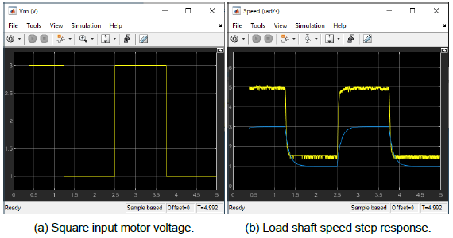
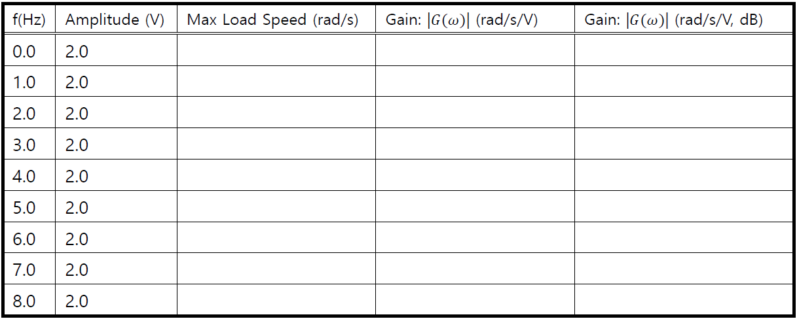

# B. Modelling (Week 1)

The objective of this experiment is to find a transfer function that describes the rotary motion of the Rotary Servo Base Unit load shaft. The dynamic model is derived analytically from classical mechanics principles and using experimental methods.

The angular speed of the Rotary Servo Base Unit load shaft with respect to the input motor voltage can be described by the following first-order transfer function:

$$
\frac{\Omega_l(s)}{V_m(s)} = \frac{K}{\tau s+1} \qquad \qquad \qquad \tag{2.1}
$$

where $$\Omega_l(\mathrm{s})$$ is the Laplace transform of the load shaft speed $$\omega_l(\mathrm{t})$$, $$V_m(\mathrm{s})$$ is the Laplace transform of motor input voltage $$v_m(\mathrm{t})$$, $$K$$ is the steady-state gain, $$\tau$$ is the time constant, and $$\mathrm{s}$$ is the Laplace operator. \
\
The Rotary Servo Base Unit transfer function model is derived analytically in [Modelling Using First-Principles](2.-modelling-week-1.md#modelling-using-first-principles) and its $$K$$ and $$\tau$$ parameters are evaluated. These are known as the nominal model parameter values. The model parameters can also be found experimentally. [Modeling Using Experiment](2.-modelling-week-1.md#modeling-using-experiments) describes how to use the frequency response and bump-test methods to find $$K$$ and $$\tau$$. These methods are useful when the dynamics of a system are not known, for example in a more complex system. After the lab experiments, the experimental model parameters are compared with the nominal values.

## 1. Modelling Using First-Principles

### a) Electrical Equations

The DC motor armature circuit schematic and gear train is illustrated in Figure 7.&#x20;

<figure><figcaption>
Figure 7 Rotary Servo Base Unit DC motor armature circuit and gear train
</figcaption></figure>

$$R_m$$ is the motor resistance, $$L_m$$ is the inductance, and $$K_m$$ is the back-emf constant.

The back-emf (electromotive) voltage $$e_b(\mathrm{t})$$ depends on the speed of the motor shaft, $$\omega_m$$, and the back-emf constant of the motor, $$k_m$$. It opposes the current flow. The back emf voltage is given by:

$$
e_b(\mathrm{t}) = k_m\omega_m(\mathrm{t}) \qquad \qquad \qquad \tag{2.2}
$$

Using Kirchoff’s Voltage Law, we can write the following equation:

$$
V_m(\mathrm{t})  - R_mI_m(\mathrm{t}) - L_m \frac{dI_m(\mathrm{t})}{dt} - k_m \omega_m(\mathrm{t}) = 0 \qquad \qquad \qquad \tag{2.3}
$$

Since the motor inductance $$L_m$$ is much less than its resistance, it can be ignored. Then, the equation becomes:

$$
V_m(\mathrm{t}) - R_mI_m(\mathrm{t})-k_m\omega_m(\mathrm{t}) = 0 \qquad \qquad \qquad \tag{2.4}
$$

Solving for $$I_m(\mathrm{t})$$, the motor current can be found as:

$$
I_m(\mathrm{t}) = \frac{V_m(\mathrm{t}) - k_m\omega_m(\mathrm{t})}{R_m} \qquad \qquad \qquad \tag{2.5}
$$

### b) Mechanical Equations

In this section, the equation of motion describing the speed of the load shaft, $$\omega_l$$, with respect to the applied motor torque, $$L_m$$, is developed. \
\
Since the Rotary Servo Base Unit is a one degree-of-freedom rotary system, Newton’s Second Law of Motion can be written as:

$$
J \cdot \alpha = \tau \qquad \qquad \qquad \tag{2.6}
$$

where $$J$$ is the moment of inertia of the body (about its center of mass), $$\alpha$$ is the angular acceleration of the system, and $$\tau$$ is the sum of the torques being applied to the body. As illustrated in Figure 7, the Rotary Servo Base Unit gear train along with the viscous friction acting on the motor shaft, $$B_m$$, and the load shaft $$B_l$$ are considered. The load equation of motion is:

$$
J_l \frac{d\omega_l(\mathrm{t})}{dt} + B_l\omega_l(\mathrm{t}) = \tau_l(\mathrm{t}) \qquad \qquad \qquad \tag{2.7}
$$

where $$J_l$$ is the moment of inertia of the load and $$\tau_l$$ is the total torque applied on the load. The load inertia includes the inertia from the gear train and from any external loads attached, e.g. disc or bar. The motor shaft equation is expressed as:

$$
J_m \frac{d\omega_l(t)}{dt} + B_m\omega_m(t) +\tau_{ml}= \tau_m(t) \qquad \qquad \qquad \tag{2.8}
$$

where $$J_m$$ is the motor shaft moment of inertia and $$\tau_{ml}$$  is the resulting torque acting on the motor shaft from the load torque. The torque at the load shaft from an applied motor torque can be written as:

$$
\tau_l(t) = \eta_gK_g\tau_{ml}(t) \qquad \qquad \qquad \tag{2.9}
$$

where $$K_g$$ is the gear ratio and $$\eta_g$$ is the gearbox efficiency. The planetary gearbox that is directly mounted on the Rotary Servo Base Unit motor (see [Rotary Servo Base Unit User Manual](2.-modelling-week-1.md#rotary-servo-user-manual) for more details) is represented by the $$N_1$$ and $$N_2$$ gears in Figure 7 and has a gear ratio of

$$
K_{gi} = \frac{N_2}{N_1} \qquad \qquad \qquad \tag{2.10}
$$

This is the internal gear box ratio. The motor gear $$N_3$$ and the load gear $$N_4$$ are directly meshed together and are visible from the outside. These gears comprise the external gear box which has an associated gear ratio of

$$
K_{ge} = \frac{N_4}{N_3} \qquad \qquad \qquad \tag{2.11}
$$

The gear ratio of the Rotary Servo Base Unit gear train is then given by:

$$
K_g = K_{ge} K_{gi} \qquad \qquad \qquad \tag{2.12}
$$

Thus, the torque seen at the motor shaft through the gears can be expressed as:

$$
\tau_{ml} (t) = \frac{\tau_l(t)}{\eta_gK_g} \qquad \qquad \qquad \tag{2.13}
$$

Intuitively, the motor shaft must rotate $$K_g$$ times for the output shaft to rotate one revolution.

$$
\theta_m(t) = K_g\theta_l(t) \qquad \qquad \qquad \tag{2.14}
$$

We can find the relationship between the angular speed of the motor shaft, $$\omega_m$$, and the angular speed of the load shaft, $$\omega_l$$ by taking the time derivative:

$$
\omega_m(t) = K_g\omega_l(t) \qquad \qquad \qquad \tag{2.15}
$$

To find the differential equation that describes the motion of the load shaft with respect to an applied motor torque substitute (Eq 2.13), (Eq 2.15) and (Eq 2.7) into (Eq 2.8) to get the following:

$$
J_mK_g \frac{d\omega_l(t)}{dt} + B_mK_g\omega_l(t) +\frac{J_l \frac{d\omega_l(t)}{dt} + B_l\omega_l(t)}{\eta_gK_g}= \tau_m(t)
\qquad \qquad \qquad \tag{2.16}
$$

Collecting the coefficients in terms of the load shaft velocity and acceleration gives

$$
(\eta_gK_g^2J_m + J_l) \frac{d\omega_l(t)}{dt} + (\eta_gK_g^2B_m + B_l)\omega_l(t)  = \eta_gK_g\tau_m(t)
\qquad \qquad \qquad \tag{2.17}
$$

Defining the following terms:

$$
J_{eq} = \eta_gK_g^2J_m+J_l \qquad \qquad \qquad \tag{2.18}
$$

$$
B_{eq} = \eta_gK_g^2B_m+B_l \qquad \qquad \qquad \tag{2.19}
$$

simplifies the equation as:

$$
J_{eq} \frac{d\omega_l(t)}{dt} +B_{eq}\omega_l(t)  = \eta_gK_g\tau_m(t)
\qquad \qquad \qquad \tag{2.20}
$$

### c) Combining the Electrical and Mechanical Equations

In this section the electrical equation and the mechanical equation are brought together to get an expression that represents the load shaft speed in terms of the applied motor voltage.

The motor torque is proportional to the voltage applied and is described as

$$
\tau_m(t) = \eta_mk_tI_m(t) \qquad \qquad \qquad \tag{2.21}
$$

where $$K_t$$ is the current-torque constant ($$N \cdot m / A$$), $$\eta_m$$ is the motor efficiency, and $$I_m$$ is the armature current. See [Rotary Servo Base Unit User Manual](2.-modelling-week-1.md#rotary-servo-user-manual) for more details on the Rotary Servo Base Unit motor specifications. \
\
We can express the motor torque with respect to the input voltage $$V_m(t)$$ and load shaft speed $$\omega_l(t)$$ by substituting the motor armature current given by Eq 2.5, into the current-torque relationship given in Eq 2.21:

$$
\tau_m(t) = \frac{\eta_mk_t(V_m(t) - k_m\omega_m(t))}{R_m} \qquad \qquad \qquad \tag{2.22}
$$

To express this in terms of $$V_m$$ and $$\omega_l$$, insert the motor-load shaft speed Eq 2.15, into Eq 2.21 to get:

$$
\tau_m(t) = \frac{\eta_mk_t(V_m(t) - k_mK_g\omega_l(t))}{R_m}
\qquad \qquad \qquad \tag{2.23}
$$

If we substitute (Eq 2.23) into (Eq 2.20), we get:

$$
J_{eq} \frac{d\omega_l(t)}{dt} +B_{eq}\omega_l(t)  = \frac{\eta_gK_g\eta_mk_t(V_m(t) - k_mK_g\omega_l(t))}{R_m}
\qquad \qquad \qquad \tag{2.24}
$$

After collecting the terms, the equation becomes

$$
J_{eq} \frac{d\omega_l(t)}{dt} +\left (\frac{k_m\eta_gK_g^2\eta_mk_t}{R_m}+B_{eq}\right) \omega_l(t)  = \frac{\eta_gK_g\eta_mk_tV_m(t) }{R_m}
\qquad \qquad \qquad \tag{2.25}
$$

This equation can be re-written as:

$$
J_{eq} \frac{d\omega_l(t)}{dt} +\left (B_{eq,v}\right) \omega_l(t)  = A_mV_m(t)
 \qquad \qquad \qquad \tag{2.26}
$$

where the equivalent damping term is given by:

$$
B_{eq,v} = \frac{k_m\eta_gK_g^2\eta_mk_t + B_{eq}R_m}{R_m} \qquad \qquad \qquad \tag{2.27}
$$

and the actuator gain equals

$$
A_m = \frac{\eta_gK_g\eta_mk_t}{R_m} \qquad \qquad \qquad \tag{2.28}
$$

## 2. Modeling Using Experiments

A linear model of a system can also be determined purely experimentally. The main idea is to experimentally observe how a system reacts to different inputs and change structure and parameters of a model until a reasonable fit is obtained. The inputs can be chosen in many different ways and there are a large variety of methods. Two methods of modeling the Rotary Servo Base Unit are: (1) frequency response and, (2) bump test.

### a) Frequency Response

In Figure 8, the response of a typical first-order time-invariant system to a sine wave input is shown. As it can be seen from the figure, the input signal ($$u$$) is a sine wave with a fixed amplitude and frequency. The resulting output ($$y$$) is also a sinusoid with the same frequency but with a different amplitude. By varying the frequency of the input sine wave and observing the resulting outputs, a Bode plot of the system can be obtained as shown in Figure 9.

<figure><figcaption>
Figure 8 Typical frequency response
</figcaption></figure>

The Bode plot can then be used to find the steady-state gain, i.e. the DC gain, and the time constant of the system. The cuttoff frequency, $$\omega_c$$, shown in Figure 9 is defined as the frequency where the gain is 3 dB less than the maximum gain (i.e. the DC gain). When working in the linear non-decibel range, the 3 dB frequency is defined as the frequency where the gain is $$\frac{1}{\sqrt{2}}$$ , or about 0.707, of the maximum gain. The cutoff frequency is also known as the bandwidth of the system which represents how fast the system responds to a given input.&#x20;

<figure><figcaption>
Figure 9 Magnitude Bode plot
</figcaption></figure>

The magnitude of the frequency response of the Rotary Servo Base Unit plant transfer function given in equation Eq 2.1 is defined as:

$$
|G_{\omega l,v}(\omega)| = \left |\frac{\Omega_l(\omega j)}{V_m(\omega j)}\right| \qquad \qquad \qquad \tag{2.29}
$$

where $$\omega$$ is the frequency of the motor input voltage signal $$V_m$$. We know that the transfer function of the system has the generic first-order system form given in Eq 2.1. By substituting $$s = j \omega$$ in this equation, we can find the frequency response of the system as:

$$
\left |\frac{\Omega_l(\omega j)}{V_m(\omega j)}\right| = \frac{K}{\tau \omega j + 1} \qquad \qquad \qquad \tag{2.30}
$$

Then, the magnitude of it equals

$$
|G_{wl,v}(w)| = \frac{K}{\sqrt{1+\tau^2\omega^2}} \qquad \qquad \qquad \tag{2.31}
$$

Let’s call the frequency response model parameters $$K_{e,f}$$ and $$\tau_{e,f}$$ to differentiate them from the nominal model parameters, $$K$$ and $$\tau$$, used previously. The steady-state gain or the DC gain (i.e. gain at zero frequency) of the model is:

$$
K_{e,f} = |G_{wl,v}(0)| \qquad \qquad \qquad \tag{2.32}
$$

### b) Bump Test / Unit Step Input Test

The bump test is a simple test based on the step response of a stable system. A step input is given to the system and its response is recorded. As an example, consider a system given by the following transfer function:&#x20;

$$
\frac{Y(s)}{U(s)} = \frac{K}{\tau s + 1} \qquad \qquad \qquad \tag{2.33}
$$

The step response shown in Figure 10 is generated using this transfer function with $$K = 5 rad/Vs$$ and $$\tau = 0.05s$$.&#x20;

The step input begins at time $$t_0$$. The input signal has a minimum value of $$u_{min}$$ and a maximum value of $$u_{max}$$. The resulting output signal is initially at $$y_0$$. Once the step is applied, the output tries to follow it and eventually settles at its steady-state value yss. From the output and input signals, the steady-state gain is&#x20;

$$
K = \frac{\Delta y}{\Delta u} \qquad \qquad \qquad \tag{2.34}
$$

where $$\Delta y = y_{ss} - y_0$$ and $$\Delta u =u_{max} - u_{min}$$. In order to find the model time constant, $$\tau$$ , we can first calculate where the output is supposed to be at the time constant from:&#x20;

$$
y(t_1) = 0.632(y_{ss}-y_0) + y_0 \qquad \qquad \qquad \tag{2.35}
$$

Then, we can read the time $$t_1$$ that corresponds to $$y(t_1)$$ from the response data in Figure 10. From the figure we can see that the time $$t_1$$ is equal to:&#x20;

$$
t_1 = t_0 + \tau \qquad \qquad \qquad \tag{2.36}
$$

<figure><figcaption>
Figure 10 Input and output signal used in the bump test method
</figcaption></figure>

From this, the model time constant can be found as:&#x20;

$$
\tau = t_1 - t_0 \qquad \qquad \qquad \tag{2.37}
$$

Going back to the Rotary Servo Base Unit system, a step input voltage with a time delay $$t_0$$ can be expressed as follows in the Laplace domain:

$$
V_m(s) = \frac{A_ve^{(-st_0)}}{s} \qquad \qquad \qquad \tag{2.38}
$$

where $$A_v$$ is the amplitude of the step and $$t_0$$ is the step time (i.e. the delay). If we substitute this input into the system transfer function given in Eq 2.1, we get:&#x20;

$$
\Omega_l(s) = \frac{KA_ve^{(-s t_0)}}{(\tau s + 1)s} \qquad \qquad \qquad \tag{2.39}
$$

We can then find the Rotary Servo Base Unit load speed step response, $$\omega_l(t)$$, by taking inverse Laplace of this equation. Here we need to be careful with the time delay $$t_0$$ and note that the initial condition is

$$
\omega_l(t) = KA_v\left(1-e^{(-\frac{t-t_0}{\tau})}\right) + \omega_l(t_0) \qquad \qquad \qquad \tag{2.40}
$$

## Pre-Lab (before lab starts)

#### <mark style="background-color:orange;">Do Problem 1,2,3,7,9,10</mark>

1. We obtained Eq (2.26) which described the dynamic behavior of the load shaft speed as a function of the motor input voltage. Starting from this equation, find the transfer function $$\frac{\Omega_l(s)}{V_m(s)}$$
2. Express the steady-state gain ($$K$$) and the time constant ($$\tau$$) of the process model Eq (2.1) in terms of the $$J_{eq}$$, $$B_{eq,v}$$, and $$A_m$$ parameters.
3. Calculate the $$B_{eq,v}$$ and $$A_m$$ model parameters using the system specifications given in [Rotary Servo Base Unit User Manual](2.-modelling-week-1.md#rotary-servo-user-manual). The parameters are to be calculated based on an the Rotary Servo Base Unit in the high-gear configuration.
4. The load attached to the motor shaft includes a 24-tooth gear, two 72-tooth gears, and a single 120-tooth gear along with any other external load that is attached to the load shaft. Thus, for the gear moment of inertia $$J_g$$ and the external load moment of inertia $$J_{l,ext}$$, the load inertia is $$J_l = J_g + J_{l,ext}$$. Using the specifications given in the Rotary Servo Base Unit User Manual find the total moment of inertia $$J_g$$ from the gears. Hint: Use the definition of moment of inertia for a disc $$J_{disc} = {mr^2}/{2}$$ .
5. Assuming that the disc load is attached to the load shaft, calculate the inertia of the disc load, $$J_d$$, and the total load moment of inertia acting on the motor shaft from the disc and gears, $$J_l$$.
6. Evaluate the equivalent moment of inertia $$J_{eq}$$. This is the total inertia from the motor, gears, and disc load. The moment of inertia of the DC motor can be found in the [Rotary Servo Base Unit User Manual](2.-modelling-week-1.md#rotary-servo-user-manual).
7. Calculate the steady-state model gain $$K$$ and time constant $$\tau$$. These are the nominal model parameters and will be used to compare with parameters that are later found experimentally.
8. Referring to the Frequency Response, find the expression representing the time constant $$\tau$$ of the frequency response model given in Eq. (2.31). Begin by evaluating the magnitude of the transfer function at the cutoff frequency $$\omega_c$$.
9. Referring to Bump Test, find the equation of steady-state gain of the step response and compare it with Eq 2.34. Hint: The the steady-state value of the load shaft speed can be defined as $$\omega_{l,ss} = \lim_{t\to \infty} \omega_l(t)$$.
10. Evaluate the step response given in Eq. (2.40) at $$t = t_0 + \tau$$ and compare it with Eq. (2.35).

## ↓↓↓ In Lab Exercise ↓↓↓

## **Experimental Setup**&#x20;

\
The q\_servo\_modeling Simulink diagram shown in Figure 11 will be used to conduct the experiments. The Rotary Servo Base Unit subsystem contains QUARC blocks that interface with the DC motor and sensors of the Rotary Servo Base Unit system. The Rotary Servo Base Unit Model uses a _Transfer Fcn_ block from the SIMULINK library to simulate the Rotary Servo Base Unit system. Thus, both the measured and simulated load shaft speed can be monitored simultaneously given an input voltage.

<figure><figcaption>
Figure 11 q_servo_modeling Simulink diagram used to model Rotary Servo Base Unit.
</figcaption></figure>



1. Download the Modeling\_files.zip and extract the files to desktop.
2. Open `q_servo_modeling.m` SIMULINK file.
3. Configure DAQ: Double-click on the HIL Initialize block in the SIMULINK diagram and ensure it is configured for the DAQ device that is installed in your system (e.g. Q2-USB).&#x20;
4. Open `setup_servo_modeling.m` file to open the setup script for the q\_servo\_modeling SIMULINK model.
5. Run the script. **Note:** The calculated servo model parameter are default model parameters and do not accurately represent the Rotary Servo Base Unit system.

## Frequency Response Experiment

The frequency response of a linear system can be obtained by providing a sine wave input signal to it and recording the resulting output sine wave from it. In this experiment, the input signal is the motor voltage and the output is the motor speed. \
\
In this method, we keep the amplitude of the input sine wave constant but vary its frequency. At each frequency setting, we record the amplitude of the output sine wave. The ratio of the output and input amplitudes at a given frequency can then be used to create a Bode magnitude plot. Then, the transfer function for the system can be extracted from this Bode plot.

### a). Steady-state gain

First, we need to find the steady-state gain of the system. This requires running the system with a constant input voltage. To create a $$2V$$ constant input voltage follow these steps:

1. In the SIMULINK **** diagram, double-click on the Signal Generator block and ensure the following parameters are set: \
   \
   • Wave form: sine \
   • Amplitude: 1.0 \
   • Frequency: 0.4\
   • Units: Hertz\

2. Set the Amplitude (V) slider gain to 0.
3. Set the Offset (V) block to 2.0 V.
4. Set the Simulation stop time to 5 seconds.
5. Open the load shaft speed scope, Speed (rad/s), and the motor input voltage scope, Vm (V) .
6. To build the model, click the down arrow on **Monitor & Tune** under the Hardware tab and then click **Build** **for monitoring** .png>). This generates the controller code.
7. Click **Connect**  button under **Monitor & Tune** and then run SIMULINK by clicking **Start** .
8.  The Rotary Servo Base Unit unit should begin rotating in one direction. The scopes should be reading something similar to figure below. Note that in the Speed (rad/s) scope, the yellow trace is the measured speed while the blue trace is the simulated speed (generated by Servo Model block).\

    <figure><figcaption>
Figure 12 Load shaft speed response to a constant input
</figcaption></figure>
9. Measure the speed of the load shaft and enter the measurement in Table B.1 below under the f = 0 Hz row. Since amplitude gain is set to 0. Technically no sine input or f = 0Hz is applied.\
   \
   **Hint**: The measurement can be done directly from the scope using the Cursor Measurements tool. Alternatively, you can **use MATLAB commands** `max(wl(:,2))` **to find the maximum load speed using the saved **_**`wl`**_** variable**. When the controller is stopped, the Speed __ (rad/s) scope saves data to the MATLAB workspace in the _`wl`_ parameter. It has the following structure: _`wl(:,1)`_ is the time vector, _`wl(:,2)`_ is the measured speed, and _`wl(:,3)`_ is the simulated speed.

<mark style="background-color:blue;">Result:</mark> Calculate the steady-state gain both in linear and decibel (dB) units as explained in [Frequency Response](2.-modelling-week-1.md#a-frequency-response). Enter the resulting numerical value in the f = 0 Hz row of Table B.1. Also, enter its non-decibel value in Table B.2 in Result.

### b). Gain at varying frequencies

In this part of the experiment, we will send an input sine wave at a certain frequency to the system and record the amplitude of the output signal. We will then increment the frequency and repeat the same observation. To create the input sine wave:

1. In the SIMULINK diagram, double-click on the Signal Generator block and ensure the following parameters are set: \
   • Wave form: sine \
   • Amplitude: 1.0 \
   • Frequency: 1.0 \
   • Units: Hertz
2. Set the _`Amplitude (V)`_ slider gain to 2.0 V.
3. Set the _`Offset (V)`_ block to 0 V.
4. Set the Simulation stop time to 5 seconds.
5. Click **Connect**  button under **Monitor & Tune** and then run SIMULINK by clicking **Start** .
6.  The Rotary Servo Base Unit unit should begin rotating smoothly back and forth and the scopes should be reading a response similar to Figure 13 a) and b).\

    <figure><figcaption>
Figure 13 Load shaft speed sine wave response
</figcaption></figure>
7. Measure the maximum positive speed of the load shaft at `f = 1.0 Hz` input and enter it in Table B.1 below. As before, this measurement can be done directly from the scope using the Cursor Measurements tool or you can use MATLAB commands to find the maximum load speed using the saved _`wl`_ variable.\
   \
   <mark style="background-color:blue;">Result:</mark> Calculate the gain of the system (in both linear and dB units) and enter the results in Table B.1.
8. Increase the frequency to _`f = 2.0 Hz`_ by adjusting the frequency parameter in the Signal Generator block. Measure the maximum load speed and calculate the gain. **Repeat** this step for each of the frequency settings in Table B.1.\
   \
   <mark style="background-color:blue;">Result:</mark> Using the MATLAB plot command and the data collected in Table B.1, generate a Bode magnitude plot. Make sure the amplitude and frequency scales are in decibels. When making the Bode plot, ignore the _`f = 0 Hz`_ entry as the logarithm of 0 is not defined.\
   \
   <mark style="background-color:blue;">Result:</mark> Calculate the time constant $$\tau_{e,f}$$ using the obtained Bode plot by finding the cutoff frequency. Label the Bode plot with the -3 dB gain and the cutoff frequency. Enter the resulting time constant in Table B.2. \
   \
   **Hint:** Use the Data Tips tool to obtain values from the MATLAB Figure.

## Step Response Experiment

In this method, a step input is given to the Rotary Servo Base Unit and the corresponding load shaft response is recorded. Using the saved response, the model parameters can then be found as discussed in [Bump Test](2.-modelling-week-1.md#b-bump-test-unit-step-input-test).

To create the step input:

1. Double-click on the Signal Generator block and ensure the following parameters are set: \
   • Wave form: square \
   • Amplitude: 1.0 \
   • Frequency: 0.4 \
   • Units: Hertz
2. Set the _`Amplitude (V)`_ gain block to 1.0 V.
3. Set the _`Offset (V)`_gain block to 2.0 V.
4. Set the Simulation stop time to 5 seconds.
5. Open the load shaft speed scope, _`Speed (rad/s)`_, and the motor input voltage cope,\
   &#x20;_`Vm (V)`_.
6. To build the model, click the down arrow on **Monitor & Tune** under the Hardware tab and then click **Build** **for monitoring** .png>). This generates the controller code.
7. Click **Connect**  button under **Monitor & Tune** and then run SIMULINK by clicking **Start** .
8.  The gears on the Rotary Servo Base Unit should be rotating in the same direction and alternating between low and high speeds. The response in the scopes should be similar to Figure 14 a) and b).\

    <figure><figcaption>
Figure 14 
</figcaption></figure>
9. Save wl data and name it as modelling\_section#\_Group#\_step.\
   \
   <mark style="background-color:blue;">Result:</mark> Plot the response in MATLAB. Recall that the maximum load speed is saved in the MATLAB workspace under the _`wl`_ variable.\
   \
   <mark style="background-color:blue;">Result:</mark> Find the steady-state gain using the measured step response and enter it in **Table B.2**. \
   \
   **Hint**: Use the MATLAB _`ginput`_ command to measure points off the plot.
10. Find the time constant from the obtained response and enter the result in Table B.2.
11. Click the Stop button on the SIMULINK diagram toolbar (or select QUARC | Stop from the menu) to stop the experiment.

## Model Validation Experiment

In this experiment, you will adjust the model parameters you found in the previous experiments to tune the transfer function. Our goal is to match the simulated system response with the parameters you found as closely as possible to the response of the actual system. To create a step input:

1. Double-click on the Signal Generator block and ensure the following parameters are set: \
   • Wave form: square \
   • Amplitude: 1.0 \
   • Frequency: 0.4 \
   • Units: Hertz
2. Set the _`Amplitude (V)`_ slider gain to 1.0 V.
3. Set the _`Offset (V)`_ block to 1.5 V.
4. Set the Simulation stop time to 5 seconds.
5. Open the load shaft speed scope, `Speed (rad/s)`, and the motor input voltage scope, _`V_m (V)`_.
6. To build the model, click the down arrow on **Monitor & Tune** under the Hardware tab and then click **Build** **for monitoring** .png>). This generates the controller code.
7. Click **Connect**  button under **Monitor & Tune** and then run SIMULINK by clicking **Start** .
8.  The gears on the Rotary Servo Base Unit should be rotating in the same direction and alternating between low and high speeds and the scopes should be as shown in Figure 15 a) and b). \
    \
    Recall that the yellow trace is the measured load shaft rate and the purple trace is the simulated trace. By default, the steady-state gain and the time constant of the transfer function used in simulation are set to: K = 1 rad/s/V and $$\tau$$ = 0.1s. These model parameters do not accurately represent the system.\
    \

    <figure><figcaption>
Figure 15 Simulation done with default model parameters: K = 1 and \tau = 0.1Save wl data and name it something like modelling_section#_Group#_K1tau01. 
</figcaption></figure>
9. Save wl data and name it as modelling\_section#\_Group#\_K1tau01.
10. Enter the command K = 1.25 in the MATLAB Command Window.
11. Update the parameters used by the Transfer Function block in the simulation by updating diagram in the q\_servo\_modeling SIMULINK diagram. \
    \
    <mark style="background-color:green;">To update the diagram, from the</mark> <mark style="background-color:green;"></mark><mark style="background-color:green;">**Modeling**</mark> <mark style="background-color:green;"></mark><mark style="background-color:green;">tab, click</mark> <mark style="background-color:green;"></mark><mark style="background-color:green;">**Update Model**</mark><mark style="background-color:green;">. Alternatively, press</mark> <mark style="background-color:green;"></mark><mark style="background-color:green;">**Ctrl+D**</mark><mark style="background-color:green;">.</mark>\ <mark style="background-color:green;"></mark>\ <mark style="background-color:green;"></mark>Connect and run the SIMULINK model and  observe how the simulation response changes. Remember we have increased K from 1 to 1.25.
12. Save wl data and name it as modelling\_section#\_Group#\_K125tau01.
13. Enter the command _`tau = 0.2`_ in the MATLAB Command Window.
14. Update the simulation again by updating diagram.\
    \
    Connect and run the SIMULINK model and  observe how the simulation response changes. Remember we have increased $$\tau$$ from 0.1 to 0.2.
15. Save wl data and name it as modelling\_section#\_Group#\_K125tau02.\
    \
    <mark style="background-color:blue;">Result:</mark> We have varied the gain and time constant model parameters. How do the gain and the time constant affect the system response?
16. Enter the nominal values, $$K$$ and $$\tau$$ , that were found in <mark style="background-color:red;">Pre-lab Q7</mark> in the MATALB Command Window. Update the parameters and examine how well the simulated response matches the measured one.
17. Save wl data and name it as modelling\_section#\_Group#\_K#tau#.\
    \
    If the calculations were done properly, then the model should represent the actual system quite well. However, there are always some differences between each servo unit and, as a result, the model can always be tuned to match the system better. <mark style="background-color:yellow;">Try varying the model parameters until the simulated trace matches the measured response better. Enter these tuned values under the Model Validation section of Table B.2.</mark>\ <mark style="background-color:yellow;"></mark>\ <mark style="background-color:yellow;"></mark>If you have tried with different <mark style="background-color:yellow;"></mark> $$K$$ and $$\tau$$ values save the data.\
    \
    <mark style="background-color:blue;">Result:</mark> Provide two reasons why the nominal model might not represent the Rotary Servo Base Unit with better accuracy.\
    \
    <mark style="background-color:blue;">Result:</mark> Create a MATLAB figure that shows the measured and simulated response of the model validation response using the tuned model parameters of $$K$$ and $$\tau$$. This can be done by manually changing the Servo Model Transfer Function block parameters or changing the _`K`_ and _`tau`_ parameters in the MATLAB Command Window and going to Simulation | Update Diagram in the SIMULINK model.\
    \
    <mark style="background-color:blue;">Result:</mark> Explain how well the nominal model, the frequency response model, and the bump-test model represent the Rotary Servo Base Unit system.

## Results

### Table B.1 Collected frequency response data.

<figure><figcaption></figcaption></figure>

### Table B.2 Summary of results for the Rotary Servo Base Unit Modeling laboratory.

<figure><figcaption></figcaption></figure>

## Appendix

### Rotary Servo User Manual



