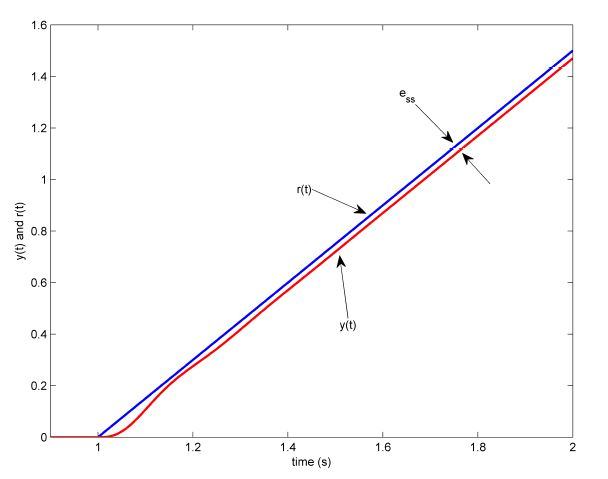
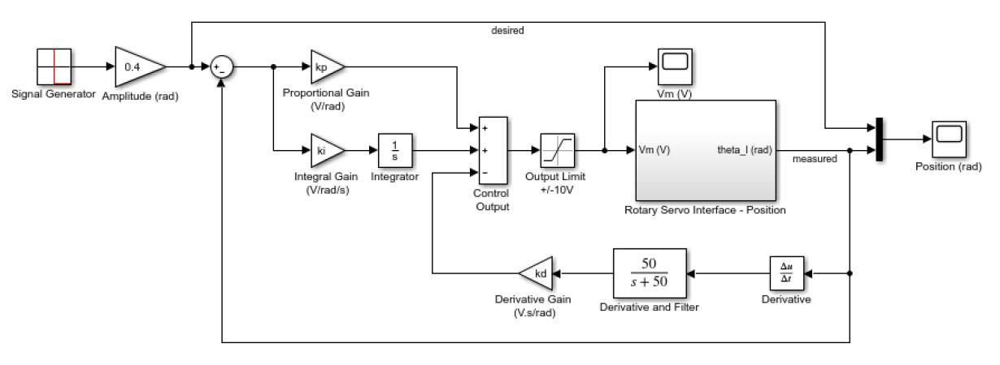

# C. Position Control (Week 2)

## 1 Background&#x20;

### 1.1 Desired Position Control Response&#x20;

The block diagram shown in Figure 16 is a general unity feedback system with a compensator (controller) $$C(s)$$ and a transfer function representing the plant, $$P(s)$$. The measured output, $$Y(s)$$, is supposed to track the reference signal $$R(s)$$ and the tracking has to match certain desired specifications.&#x20;

<figure><figcaption>
Figure 16. Unity feedback system
</figcaption></figure>

The output of this system can be written as:&#x20;

$$
Y (s) = C(s)P(s) (R(s) - Y (s)) \qquad \qquad \qquad \tag{3.1}
$$

By solving for $$Y(s)$$, we can find the **closed-loop** transfer function:&#x20;

$$
\frac{Y(s)}{R(s)} = \frac{C(s)P(s)}{1 + C(s)P(s)} \qquad \qquad \qquad \tag{3.2}
$$

Recall in the Integration laboratory experiment, the Rotary Servo Base Unit voltage-to-speed transfer function was derived. To find the voltage-to-position transfer function, we can put an integrator $$(1/s)$$ in series with the speed transfer function (effectively integrating the speed output to get position). Then, the resulting open-loop voltage-to-load gear position transfer function becomes:&#x20;

$$
P(s) = \frac{K}{s(\tau s + 1)} \qquad \qquad \qquad \tag{3.3}
$$

As you can see from this equation, the plant is a second-order system. In fact, when a second-order system is placed in series with a proportional compensator in the feedback loop as in Figure 16, the resulting closed-loop transfer function can be expressed as:&#x20;

$$
\frac{Y(s)}{R(s)} = \frac{\omega_n^2}{s^2 + 2\zeta \omega_n s + \omega_n^2} \qquad \qquad \qquad \tag{3.4}
$$

where $$\omega_n$$ is the natural frequency and $$\zeta$$ is the damping ratio. This is called the standard second-order transfer function. Its response depends on the values of $$\omega_n$$ and $$\zeta$$.&#x20;

#### 1.1.1 Peak Time and Overshoot&#x20;

Consider a second-order system as shown in Equation 3.4 subject to a step input given by

$$
R(s) = \frac{R_0}{s} \qquad \qquad \qquad \tag{3.5}
$$

with a step amplitude of $$R_0 = 1.5$$. The system response to this input is shown in Figure 17, where the red trace is the response (output), $$y(t)$$, and the blue trace is the step input $$r(t)$$.

The maximum value of the response is denoted by the variable $$y_{\text{max}}$$ and it occurs at a time $$t_{\text{max}}$$. The initial value of the response is denoted as $$y_0$$. For a response similar to Figure 17, the percent overshoot is found using &#x20;

$$
\text{PO} = \frac{100 (y_{\text{max}} - R_0)}{R_0} \qquad \qquad \qquad \tag{3.6}
$$

<figure><figcaption>
Figure 17. Standard second-order step response.
</figcaption></figure>

From the initial step time, $$t_0$$, the time it takes for the response to reach its maximum value is&#x20;

$$
t_p = t_{\text{max}} - t_0 \qquad \qquad \qquad \tag{3.7}
$$

This is called the **peak time** of the system.

In a second-order system, the amount of overshoot depends solely on the damping ratio parameter and it can be calculated using the equation

$$
\text{PO} = 100 e^{\left(-\frac{\pi \zeta}{\sqrt{1 - \zeta^2}}\right)} \qquad \qquad \qquad \tag{3.8}
$$

The peak time depends on both the damping ratio and natural frequency of the system and it can be derived as:&#x20;

$$
t_p = \frac{\pi}{\omega_n \sqrt{1 - \zeta^2}} \qquad \qquad \qquad \tag{3.9}
$$

Generally speaking, the damping ratio affects the shape of the response while the natural frequency affects the speed of the response.&#x20;

#### 1.1.2 Steady State Error

Steady-state error is illustrated in the ramp response given in Figure 18 and is denoted by the variable $$e_{\text{ss}}$$. It is the difference between the reference input and output signals after the system response has settled. Thus, for a time $$t$$ when the system is in steady-state, the steady-state error equals&#x20;

$$
e_{\text{ss}} = r_{\text{ss}}(t) - y_{\text{ss}}(t) \qquad \qquad \qquad \tag{3.10}
$$

where $$r_{\text{ss}}(t)$$ is the value of the steady-state input and $$y_{\text{ss}}(t)$$ is the steady-state value of the output.

We can find the error transfer function $$E(s)$$ in Figure 16 in terms of the reference $$R(s)$$, the plant $$P(s)$$, and the compensator $$C(s)$$. The Laplace transform of the error is&#x20;

$$
E(s) = R(s) - Y (s) \qquad \qquad \qquad \tag{3.11}
$$

Solving for $$Y (s)$$ from Equation 3.3 and substituting it in Equation 3.11 yields&#x20;

$$
E(s) = \frac{R(s)}{1 + C(s)P(s)} \qquad \qquad \qquad \tag{3.12}
$$

<figure><figcaption>
Figure 18. Steady-state error in ramp response.
</figcaption></figure>

We can find the steady-state error of this system using the final-value theorem: &#x20;

$$
e_{\text{ss}} = \lim_{s \to 0} sE(s) \qquad \qquad \qquad \tag{3.13}
$$

In this equation, we need to substitute the transfer function for $$E(s)$$ from Equation 3.12. The $$E(s)$$ transfer function requires, $$R(s)$$, $$C(s)$$ and $$P(s)$$. For simplicity, let $$C(s) = 1$$ as a compensator. The $$P(s)$$ and $$R(s)$$ were given by equations Equation 3.3 and Equation 3.5, respectively. Then, the error becomes:&#x20;

$$
E(s) = \frac{R(s)}{s\left(1 + \frac{K}{s(\tau s + 1)}\right)} \qquad \qquad \qquad \tag{3.14}
$$

Applying the final-value theorem gives&#x20;

$$
e_{\text{ss}} = R_0\left(\lim_{s \to 0} \frac{(\tau s+1)s}{\tau s^2 + s + K}\right) \qquad \qquad \qquad \tag{3.15}
$$

When evaluated, the resulting steady-state error due to a step response is&#x20;

$$
e_{\text{ss}} = 0 \qquad \qquad \qquad \tag{3.16}
$$

Based on this zero steady-state error for a step input, we can conclude that the Rotary Servo Base Unit is a _Type 1_ system.&#x20;

#### 1.1.3 Time-Domain Control Specifications&#x20;

The desired time-domain specifications for controlling the position of the Rotary Servo Base Unit load shaft are:&#x20;

$$
e_{\text{ss}} = 0 \qquad \qquad \qquad \tag{3.17}
$$

$$
t_p = 0.20 ~\text{s} \qquad \qquad \qquad \tag{3.18}
$$

and&#x20;

$$
\text{PO} = 5.0 \% \qquad \qquad \qquad \tag{3.19}
$$

Thus, when tracking the load shaft reference, the transient response should have a peak time less than or equal to 0.20 seconds, an overshoot less than or equal to 5%, and the steady-state response should have no error.

### 1.2 PD Controller Design&#x20;

#### 1.2.1 Closed Loop Transfer Function&#x20;

The **proportional-derivative (PD)** compensator to control the position of the Rotary Servo Base Unit has the following structure &#x20;

$$
V_m(t) = k_p(\theta_d(t) - \theta_l(t)) - k_d \left(\frac{d}{dt} \theta_l(t)\right) \qquad \qquad \qquad \tag{3.20}
$$

where $$k_p$$ is the proportional control gain, $$k_d$$ is the derivative control gain, $$\theta_d(t)$$ is the setpoint or reference load shaft angle, $$\theta_l(t)$$ is the measured load shaft angle, and $$V_m(t)$$ is the Rotary Servo Base Unit motor input voltage. The block diagram of the PD control is given in Figure 19.


This is a variation of the classic PD control where the D-term is in the feedback path as opposed to in the forward path.&#x20;


<figure><figcaption>
Figure 19. Block diagram of Rotary Servo Base Unit PD position control.
</figcaption></figure>

We need to find the closed-loop transfer function $$\Theta_l(s)/\Theta_d(s)$$ for the closed-loop position control of the Rotary Servo Base Unit. Taking the Laplace transform of Equation 3.20 gives&#x20;

$$
V_m(s) = k_p(\Theta_d(s) - \Theta_l(s)) - k_d s \Theta_l(s) \qquad \qquad \qquad \tag{3.21}
$$

From the Plant block in Figure 19 and Equation 3.3, we can write&#x20;

$$
\frac{\Theta_l(s)}{V_m(s)} = \frac{K}{s(\tau s + 1)} \qquad \qquad \qquad \tag{3.22}
$$

Substituting Equation 3.21 into Equation 3.22 and solving for $$\Theta_l(s)/\Theta_d(s)$$ gives the Rotary Servo Base Unit position closed-loop transfer function as:&#x20;

$$
\frac{\Theta_l(s)}{V_m(s)} = \frac{K k_p}{\tau s^2 + (1 + K k_d)s + K k_p} \qquad (3.23)
$$

#### 1.2.2 Controller Gain Limits&#x20;

In control design, a factor to be considered is saturation. This is a nonlinear element and is represented by a saturation block as shown in Figure 20. In a system like the Rotary Servo Base Unit, the computer calculates a numeric control voltage value. This value is then converted into a voltage, $$V_{\text{dac}}(t)$$, by the digital-to-analog converter of the data-acquisition device in the computer. The voltage is then amplified by a power amplifier by a factor of $$K_a$$. If the amplified voltage, $$V_{\text{amp}}(t)$$, is greater than the maximum output voltage of the amplifier or the input voltage limits of the motor (whichever is smaller), then it is saturated (limited) at $$V_{\text{max}}$$. Therefore, the input voltage $$V_m(t)$$ is the effective voltage being applied to the Rotary Servo Base Unit motor.

The limitations of the actuator must be taken into account when designing a controller. For instance, the voltage entering the Rotary Servo Base Unit motor should never exceed&#x20;

$$
V_{\text{max}} = 10.0 V \qquad \qquad \qquad \tag{3.24}
$$

<figure><figcaption>
Figure 20. Actuator saturation.
</figcaption></figure>

#### 1.2.3 Ramp Steady State Error Using PD Control&#x20;

From our previous steady-state analysis, we found that the closed-loop Rotary Servo Base Unit system is a Type 1 system. In this section, we will investigate the steady-state error due to a ramp input when using PD controller.

Given the following ramp setpoint (input)&#x20;

$$
R(s) = \frac{R_0}{s^2} \qquad \qquad \qquad \tag{3.25}
$$

we can find the error transfer function by substituting the Rotary Servo Base Unit closed-loop transfer function in Equation 3.23 into the formula given in Equation 3.11. Using the variables of the Rotary Servo Base Unit, this formula can be rewritten as $$E(s) = \Theta_d(s) - \Theta_l(s)$$. After rearranging the terms we find:

$$
E(s) = \frac{\Theta_d(s) s(\tau s + 1 + K k_d)}{\tau s^2 + s + K k_p + K k_ds } \qquad \qquad \qquad \tag{3.26}
$$

Substituting the input ramp transfer function Equation 3.25 into the $$\Theta_d(s)$$ variable gives&#x20;

$$
E(s) = \frac{R_0(\tau s + 1 + K k_d)}{s(\tau s^2 + s + K k_p + K k_ds)} \qquad \qquad \qquad \tag{3.27}
$$

### 1.3 PID Controller Design&#x20;

Adding integral control can help eliminate _steady-state error_. The proportional-integral-derivative (PID) algorithm to control the position of the Rotary Servo Base Unit is shown in Figure 1.6. The motor voltage will be generated by the PID according to:&#x20;

$$
V_m(t) = k_p(\theta_d(t) - \theta_l(t)) +k_i \int (\theta_d(t) - \theta_l(t))dt - k_d \left(\frac{d}{dt} \theta_l(t)\right) \qquad \qquad \qquad \tag{3.28}
$$

where $$k_p$$ is the proportional control gain, $$k_i$$ is the integral gain, $$k_d$$ is the derivative control gain, $$\theta_d(t)$$ is the setpoint or reference load shaft angle, $$\theta_l(t)$$ is the measured load shaft angle, and $$V_m(t)$$ is the Rotary Servo Base Unit motor input voltage.&#x20;


This is a variation of the standard PID control with the D-term in the feedback path as opposed to the feedforward path.


We need to find the closed-loop transfer function $$\Theta_l(s)/\Theta_d(s)$$ for the closed-loop position control of the Rotary Servo Base Unit. Taking the Laplace transform of Equation 3.28 gives&#x20;

$$
V_m(s) = \left(k_p + \frac{k_i}{s}\right)(\Theta_d(s) - \Theta_l(s)) - k_d s \Theta_l(s) \qquad \qquad \qquad \tag{3.29}
$$

From the Plant block in Figure 21 and Equation 3.3, we can write&#x20;

$$
\frac{\Theta_l(s)}{V_m(s)} = \frac{K}{(\tau s + 1)s} \qquad \qquad \qquad \tag{3.30}
$$

<figure><figcaption>
Figure 21. Block diagram of PID Rotary Servo Base Unit position control.
</figcaption></figure>

Substituting Equation 3.29 into Equation 3.30 and solving for $$\Theta_l(s)/\Theta_d(s)$$ gives the Rotary Servo Base Unit position closed-loop transfer function as:

$$
\frac{\Theta_l(s)}{\Theta_d(s)} = \frac{K (k_p s + k_i)}{\tau s^3 + (1 + K k_d)s^2 + K k_p s + K k_i} \qquad \qquad \qquad \tag{3.31}
$$

#### 1.3.1 Ramp Steady-State Error using PID Controller&#x20;

To find the steady-state error of the Rotary Servo Base Unit for a ramp input under the control of the PID substitute the closed-loop transfer function from Equation 3.31 into Equation 3.11&#x20;

$$
E(s) = \frac{\Theta_d(s) s^2(\tau s + 1 + K k_d)}{\tau s^3 + s^2 + K k_p s + K k_i + K k_d s^2} \qquad \qquad \qquad \tag{3.32}
$$

Then, substituting the reference ramp transfer function Equation 3.25 into the $$\Theta_d(s)$$ variable gives&#x20;

$$
E(s) = \frac{R_0(\tau s + 1 + K k_d)}{s(\tau s^3 + s^2 + K k_p s + K k_i + K k_d s^2)} \qquad \qquad \qquad \tag{3.33}
$$

#### 1.3.2 Integral Gain Design&#x20;

It takes a certain amount of time for the output response to track the ramp reference with zero steady-state error. This is called the **settling time** and it is determined by the value used for the integral gain.

In steady-state, the ramp response error is constant. Therefore, to design an integral gain the velocity compensation (the V signal) can be neglected. Thus, we have a PI controller left as:&#x20;

$$
V_m(t) = k_p(\theta_d(t) - \theta_l(t)) +k_i \int (\theta_d(t) - \theta_l(t))dt \qquad \qquad \qquad \tag{3.34}
$$

When in steady-state, the expression can be simplified to&#x20;

$$
V_m(t) = k_p e_{\text{ss}} + k_i \int_0^{t_i} e_{\text{ss}} dt \qquad \qquad \qquad \tag{3.35}
$$

where the variable $$t_i$$ is the integration time.

## 2 Pre-Lab Questions

<mark style="background-color:orange;">Do problems 1 - 7</mark>

1. Calculate the maximum overshoot of the response (in radians) given a step setpoint of 45 deg and the overshoot specification given in [Section 1.1.3](3.-position-control-week-2.md#1.1.3-time-domain-control-specifications).\
   **Hint**: By substituting $$y_{\text{max}} = \theta(t_p)$$ and step setpoint $$R_0 = \theta_d(t)$$ into Equation 3.6, we can obtain $$\theta(t_p) = \theta_d(t) \left(1 + \frac{\text{PO}}{100} \right)$$. Recall that the desired response specifications include 5% overshoot.
2. The Rotary Servo Base Unit closed-loop transfer function was derived in Equation 3.23 in [Section 1.2.1](3.-position-control-week-2.md#1.2.1-closed-loop-transfer-function). Find the control gains $$k_p$$ and $$k_d$$ in terms of $$\omega_n$$ and $$\zeta$$.\
   **Hint**: Remember the standard second-order system equation.
3. Calculate the minimum damping ratio and natural frequency required to meet the specifications given in [Section 1.1.3](3.-position-control-week-2.md#1.1.3-time-domain-control-specifications).
4. Based on the nominal Rotary Servo Base Unit model parameters, $$K$$ and $$\tau$$, found in the Modeling laboratory experiment, calculate the control gains needed to satisfy the time-domain response requirements given in [Section 1.1.3](3.-position-control-week-2.md#1.1.3-time-domain-control-specifications). (Use $$K = 1.53$$ rad/(Vs) and $$\tau = 0.0217$$) (Need answers from Q2 and Q3)
5. In the PD controlled system, for a reference step of $$\pi/4$$ (i.e. 45 deg step) starting from $$\theta_l(t) = 0$$ position, calculate the maximum proportional gain that would lead to providing the maximum voltage to the motor. Ignore the derivative control ($$k_d = 0$$). Can the desired specifications be obtained based on this maximum available gain and what you calculated in Question 4? (Need answer from Q4)
6. For the PD controlled closed-loop system, find the steady-state error and evaluate it numerically given a ramp with a slope of $$R_0 = 3.36$$ rad/s. Use the control gains found in Question 4. (Need answer from Q4)
7. What should the integral gain $$k_i$$ be so that when the Rotary Servo Base Unit is supplied with the maximum voltage of $$V_{\text{max}} = 10$$V it can eliminate the steady-state error calculated in Question 6 in 1 second? (Need answers from Q4 and Q6)\
   **Hint**: Start from Equation 3.35 and use $$t_i = 1$$, $$V_m(t) = 10$$, the $$k_p$$ you found in Question 4 and $$e_{\text{ss}}$$ found in Question 6. Remember that $$e_{\text{ss}}$$ is constant.

## ↓↓↓ In Lab Exercise ↓↓↓

The main goal of this laboratory is to explore _position control_ of the Rotary Servo Base Unit load shaft using PD and PID controllers. In this laboratory, you will conduct the following experiments:

1. Step response with PD controller,
2. Ramp response with PD controller, and
3. Ramp response with PID controller.

In each experiment, you will first simulate the closed-loop response of the system. Then, you will implement the controller using the Rotary Servo Base Unit hardware and software to compare the real response to the simulated one.

#### Position Control MATLAB/SIMULINK Files



## 3.1 Step Response using PD Controller

### 3.1.1 Simulation

First, you will simulate the closed-loop response of the Rotary Servo Base Unit with a PD controller to step input. Our goals are to confirm that the desired response specifications in an ideal situation are satisfied and to verify that the motor is not saturated. Then, you will explore the effect of using a high-pass filter, instead of a direct derivative, to create the velocity signal in the controller.

#### Simulation Setup

The `s_servo_pos_cntrl` SIMULINK diagram shown in Figure 22 will be used to simulate the closed-loop position control response with the PD and PID controllers. The Rotary Servo Base Unit Model uses a Transfer Fcn block from the SIMULINK library. The PID Control subsystem contains the PID controller detailed in [Section 1.3](3.-position-control-week-2.md#1.3-pid-controller-design). When the integral gain is set to zero, it essentially becomes a PD controller.

<figure><figcaption>
Figure 22. Simulink model used to simulate the Rotary Servo Base Unit closed-loop position response.
</figcaption></figure>

1. Download the [PositionControl\_files.zip](3.-position-control-week-2.md#position-control-matlab-simulink-files) and extract the files to the desktop.
2. Open the `setup_servo_pos_cntrl.m` file to open the setup script for the position control Simulink models.
3. Replace the default model parameters (`K` and `tau`) with the values calculated from the Modelling section in the setup script.
4. Run the script, which will generate the model parameters, specifications, and default PID gains.\
   **Note**: The calculated PID gains are all set to zero by default and they need to be changed over the course of the experiment.

#### Simulation: Closed-loop Response with PD Controller

1. Enter the proportional and derivative control gains found in Pre-Lab Question 4 in the Matlab command window as `kp` and `kd`.
2. Set the integral gain to 0 in the Matlab window, denoted as `ki`.
3. To generate a step reference, ensure the _`Signal Generator`_ is set to the following:
   * Signal type = _square_
   * Amplitude = 1
   * Frequency = 0.4 Hz
4. In the Simulink diagram, set the _`Amplitude (rad)`_ gain block to 0.4 (rad) to generate a step with an amplitude of 45.8 degrees (i.e. square wave goes between $$\pm0.4$$ which results in a step amplitude of 0.8 rad).
5. Set the _`Manual Switch`_ such that the velocity of the motor load shaft is fed back directly.
6. Open the servo position _`Position (rad)`_ scope and the motor input voltage _`Vm (V)`_ scope.
7.  Start the simulation. By default, the simulation runs for 5 seconds. The scopes should be displaying responses similar to Figure 23a and Figure 23b. Note that in the _`theta_l (rad)`_ scope, the yellow trace is the setpoint position while the purple trace is the simulated position (generated by the _Rotary Servo Base Unit Model_ block). This simulation is called the _Ideal PD_ response as it uses the PD compensator with the derivative block.\

    <figure><figcaption>
Figure 23. Simulated PD control response using direct derivative
</figcaption></figure>
8. After each simulation run, each scope automatically saves its response to a variable in the MATLAB workspace. That is, the _`Position (rad)`_ scope saves its response to the variable called `data_pos` and the _`Vm (V)`_ scope saves its data to the `data_vm` variable. The `data_pos` variable has the following structure: `data_pos(:,1)` is the time vector, `data_pos(:,2)` is the setpoint, and `data_pos(:,3)` is the simulated angle. For the `data_vm` variable, `data_vm(:,1)` is the time and `data_vm(:,2)` is the simulated input voltage.
9. Save `Vm` and `data_pos` data and name it suitably (e.g. posnctrl\_section#\_Group#\_step).\
   \
   <mark style="background-color:blue;">Result:</mark> Generate a MATLAB figure showing the Ideal PD position response and the ideal input voltage.\

10. Measure the steady-state error, the percent overshoot and the peak time of the simulated response.\
    \
    <mark style="background-color:blue;">Result:</mark> Does the response satisfy the specifications given in [Section 1.1.3](3.-position-control-week-2.md#1.1.3-time-domain-control-specifications)?\
    \
    **Hint**: You can use the _Cursor Measurements_ tool in the Simulink scopes or save the data and use MATLAB function : `stepinfo()`.

#### Simulation: Using a Filtered Derivative

When implementing a controller on actual hardware, it is generally not advised to take the direct derivative of a measured signal. Any noise or spikes in the signal becomes amplified and gets multiplied by a gain and fed into the motor which may lead to damage. To remove any high-frequency noise components in the velocity signal, a low-pass filter is placed in series with the derivative, i.e. taking the high-pass filter of the measured signal. However, as with a controller, the filter must also be tuned properly. In addition, the filter has some adverse effects (ex. filter could add some delays to the system).

1. Set the _`Manual Switch`_ block to the down position to enable the derivative and filter.
2. Start the simulation. The response in the scopes should still be similar to Figure 23a and Figure 23b. This simulation is called the _Filtered PD_ response as it uses the PD controller with the high-pass filter block.\
   \
   <mark style="background-color:blue;">Result:</mark> Generate a MATLAB figure showing the _Filtered PD_ position and input voltage responses.\

3. Measure the steady-state error, peak time, and percent overshoot. \
   \
   <mark style="background-color:blue;">Result:</mark> Are the specifications still satisfied without saturating the actuator? Recall that the peak time and percent overshoot should not exceed the values given in [Section 1.1.3](3.-position-control-week-2.md#1.1.3-time-domain-control-specifications). Discuss the changes from the ideal response.\
   \
   **Hint**: The difference in the response is minor. Make sure you use _Cursor Measurements_ tool in the Simulink scope to take precise measurements.

### 3.1.2 Experiment

In this experiment, we will control the _angular position_ of the Rotary Servo Base Unit load shaft, i.e. the disc load, using the PD controller. Measurements will then be taken to ensure that the specifications are satisfied.

#### Experimental Setup

The `q_servo_pos_cntrl` SIMULINK diagram shown in Figure 24 is used to implement the position control experiments. The `Rotary Servo Interface - Position` subsystem contains QUARC blocks that interface with the DC motor and sensors of the Rotary Servo Base Unit system, as discussed in the Integration laboratory experiment. The _PID Control_ subsystem implements the PID controller detailed in [Section 1.3](3.-position-control-week-2.md#1.3-pid-controller-design), except a low-pass filter is placed in series with the derivative to remove the noise.

<figure><figcaption>
Figure 24. Simulink/QUARC model used with to run the PID position controller on the Rotary Servo Base Unit.
</figcaption></figure>

1. From the extracted files, open `q_servo_pos_cntrl` Simulink file.
2. **Configure DAQ**: Double-click on the HIL Initialize block in the `Rotary Servo Interface` subsystem (which is located inside the `Rotary Servo Interface - Position` subsystem) Simulink diagram and ensure it is configured for the DAQ device that is installed in your system (e.g. Q2-USB).&#x20;
3. Open `setup_servo_pos_cntrl.m` file and run the script.

#### Experiment

1. Enter the proportional and derivative control gains found in Pre-Lab Question 4.
2. Set _Signal Type_ in the _`Signal Generator`_ block to _square_ to generate a step reference.
3. Set the _`Amplitude (rad)`_ gain block to 0.4 to generate a step with an amplitude of 45.8 degrees.
4. Open the load shaft position scope, _`Position (rad)`_, and the motor input voltage scope, _`Vm (V)`_.
5. Build the model by clicking on the down arrow on **Monitor & Tune** under the Hardware tab and then select **Build** **for monitoring** .png>). This compiles the Simulink diagram.
6.  Click **Connect**  button under **Monitor & Tune** and then run SIMULINK by clicking **Start**  to begin running the controller. The scopes should display responses similar to Figure 25a and Figure 25b.\

    <figure><figcaption>
Figure 25. PD control response on Rotary Servo Base Unit
</figcaption></figure>
7. When a suitable response is obtained, click on the Stop button in the SIMULINK diagram toolbar to stop running the code. As in the s\_servo\_pos\_cntrl SIMULINK diagram, when the controller is stopped each scope automatically saves its response to a variable in the MATLAB workspace. Thus the _`theta_l (rad)`_ scope saves its response to the `data_pos` variable and the _`Vm (V)`_ scope saves its data to the `data_vm` variable.
8. Save the data in the MATLAB workspace with a suitable name.\
   \
   <mark style="background-color:blue;">Result:</mark> Generate a MATLAB figure showing the PD position response and its input voltage.\

9. Measure the steady-state error, the percent overshoot, and the peak time of the Rotary Servo Base Unit load gear. \
   \
   <mark style="background-color:blue;">Result:</mark> Does the response satisfy the specifications given in [Section 1.1.3](3.-position-control-week-2.md#1.1.3-time-domain-control-specifications)?\

10. Click the Stop button on the SIMULINK diagram toolbar to stop the experiment.

## 3.2 Ramp Response using PD Controller

### 3.2.1 Simulation

In this simulation, the goal is to verify that the system with the PD controller can meet the zero steady-state error specification without saturating the motor.

Similar to the Step Response experiment in [Section 3.1](3.-position-control-week-2.md#3.1-step-response-using-pd-controller), in this experiment you need to use the `s_servo_pos_cntrl` Simulink diagram shown in Figure 22 in [Section 3.1.1](3.-position-control-week-2.md#3.1.1-simulation) again.

1. Clear the workspace and run the `setup_servo_pos_cntrl.m` script in MATLAB.
2. Enter the proportional and derivative control gains found in Pre-Lab Question 4 and set the integral gain to 0.
3. Set the _`Signal Generator`_ parameters to the following to generate a triangular reference (which corresponds to a ramp input):
   * Signal Type = _triangle_
   * Amplitude = 1
   * Frequency = 0.8 Hz
4. Setting the frequency to 0.8 Hz will generate an increasing and decreasing ramp signal with the same slope used in the Pre-Lab Question 6. The slope is calculated from the _Triangular Waveform_ amplitude, _Amp_, and frequency, _f_, using the expression:\
   $$R_0 = 4~\text{Amp~f}$$
5. In the SIMULINK diagram, set the _`Amplitude (rad)`_ gain block to $$\pi/3$$.
6. Inside the _`PID Control`_ subsystem, set the _`Manual Switch`_ to the down position so that the _`High-Pass Filter`_ block is used.
7. Open the load shaft position scope, _`Position (rad)`_, and the motor input voltage scope, _`Vm (V)`_.
8.  Start the simulation. The scopes should display responses similar to Figure 26a and Figure 26b.\

    <figure><figcaption>
Figure 26. Simulated ramp response using PD control
</figcaption></figure>
9. Save the data in the workspace using a suitable name.\
   \
   <mark style="background-color:blue;">Result:</mark> Generate a MATLAB figure showing the Ramp PD position response and its corresponding input voltage trace.\

10. Measure the steady-state error. \
    \
    <mark style="background-color:blue;">Result:</mark> Compare the simulation measurement with the steady-state error calculated in Pre-Lab Question 6.

### 3.2.2 Experiment

In this experiment, we will control the angular position of the Rotary Servo Base Unit load shaft, i.e. the disc load, using a PD controller. The goal is to examine how well the system can track a triangular (ramp) position input. Measurements will then be taken to ensure that the specifications are satisfied.

As in the Step Response experiment in [Section 3.1](3.-position-control-week-2.md#3.1-step-response-using-pd-controller), in this experiment, you also need to use the `q_servo_pos_cntrl` SIMULINK diagram shown in Figure 24 to implement the position control experiments.

1. Clear the workspace and run the `setup_servo_pos_cntrl.m` script in MATLAB.
2. Enter the proportional and derivative control gains found in Pre-Lab Question 4.
3. Set the _`Signal Generator`_ parameters to the following to generate a triangular reference (i.e. ramp reference):
   * Signal Type = _triangle_
   * Amplitude = 1
   * Frequency = 0.8 Hz
4. In the Simulink diagram, set the _`Amplitude (rad)`_ gain block to $$\pi/3$$.
5. Open the load shaft position scope, _`Position (rad)`_, and the motor input voltage scope, _`Vm (V)`_.
6. Build the model by clicking on the down arrow on **Monitor & Tune** under the Hardware tab and then select **Build** **for monitoring** .png>).
7.  Click **Connect**  button under **Monitor & Tune** and then run SIMULINK by clicking **Start**  to begin running the controller. The scopes should display responses similar to Figure 27a and Figure 27b.\

    <figure><figcaption>
Figure 27. Ramp response using PD control on Rotary Servo Base Unit
</figcaption></figure>
8. Save the data in the workspace using a suitable name.\
   \
   <mark style="background-color:blue;">Result:</mark> Generate a MATLAB figure showing the Ramp PD position response and its corresponding input voltage trace.\

9. Measure the steady-state error. \
   \
   <mark style="background-color:blue;">Result:</mark> Compare it with the steady-state error calculated in Pre-Lab Question 6.

## 3.3 Ramp Response with No Steady-State Error

Design an experiment to see if the steady-state error can be eliminated when tracking a ramp input. First, simulate the response, then implement it using the Rotary Servo Base Unit system.

1. How can the PD controller be modified to eliminate the steady-state error in the ramp response? State your hypothesis and describe the anticipated cause-and-effect leading to the expected result.\
   **Hint**: Look through [Section 1](3.-position-control-week-2.md#1-background).
2. List the independent and dependent variables of your proposed controller. Explain their relationship.
3. Your proposed controller, like the PD compensator, is a model-based controller. This means that the control gains generated are based on a mathematical representation of the system. Given this, list the assumptions you are making in this control design. State the reasons for your assumptions.
4. Give a brief, general overview of the steps involved in your experimental procedure for two cases: (1) Simulation, and (2) Experimental implementation.\
   <mark style="background-color:yellow;">**Note**</mark><mark style="background-color:yellow;">: In case of time constraints, follow the same steps for Simulation as per</mark> [<mark style="background-color:yellow;">Section 3.2.1</mark>](3.-position-control-week-2.md#3.2.1-simulation) <mark style="background-color:yellow;">and Experiment as per</mark> [<mark style="background-color:yellow;">Section 3.2.2</mark>](3.-position-control-week-2.md#3.2.2-experiment)<mark style="background-color:yellow;">, except the value of</mark> <mark style="background-color:yellow;"></mark><mark style="background-color:yellow;">**ki**</mark> <mark style="background-color:yellow;"></mark><mark style="background-color:yellow;"></mark> (i.e., **ki** $$\ne$$ **0**).
5. For each case, generate a Matlab figure showing the position response of the system and its corresponding input voltage.
6. In each case, measure the steady-state error.
7. For each case comment on whether the steady-state specification given in [Section 1.1.3](3.-position-control-week-2.md#1.1.3-time-domain-control-specifications) was satisfied without saturating the actuator.

## 4 Results for the Report

1. Pre-lab calculations.
2. Model parameters ($$K$$ and $$\tau$$) and controller gains ($$k_p$$, $$k_d$$ and $$k_i$$) implemented during the In-Lab Simulations and Experiments.
3. Response plots from In-Lab Simulations and Experiments ([Section 3.1.1](3.-position-control-week-2.md#3.1.1-simulation): [Step 9](3.-position-control-week-2.md#simulation-closed-loop-response-with-pd-controller), [Step 2](3.-position-control-week-2.md#simulation-using-a-filtered-derivative); [Section 3.1.2](3.-position-control-week-2.md#3.1.2-experiment): Step 8; [Section 3.2.1](3.-position-control-week-2.md#3.2.1-simulation): Step 9; [Section 3.2.2](3.-position-control-week-2.md#3.2.2-experiment): Step 8; [Section 3.3](3.-position-control-week-2.md#3.3-ramp-response-with-no-steady-state-error): Step 5).
4. Corresponding measured peak time, percent overshoot and steady-state error for the response plots mentioned above ([Section 3.1.1](3.-position-control-week-2.md#3.1.1-simulation): [Step 10](3.-position-control-week-2.md#simulation-closed-loop-response-with-pd-controller), [Step 3](3.-position-control-week-2.md#simulation-using-a-filtered-derivative); [Section 3.1.2](3.-position-control-week-2.md#3.1.2-experiment): Step 9; [Section 3.2.1](3.-position-control-week-2.md#3.2.1-simulation): Step 10; [Section 3.2.2](3.-position-control-week-2.md#3.2.2-experiment): Step 9; [Section 3.3](3.-position-control-week-2.md#3.3-ramp-response-with-no-steady-state-error): Step 6).\
   **Note**: Peak time and percent overshoot are required only for step response simulation and experiment, not ramp response.
5. Answer all the questions asked in all the In-Lab simulations and experiments ([Section 3.1.1](3.-position-control-week-2.md#3.1.1-simulation): [Step 10](3.-position-control-week-2.md#simulation-closed-loop-response-with-pd-controller), [Step 3](3.-position-control-week-2.md#simulation-using-a-filtered-derivative); [Section 3.1.2](3.-position-control-week-2.md#3.1.2-experiment): Step 9; [Section 3.2.1](3.-position-control-week-2.md#3.2.1-simulation): Step 10; [Section 3.2.2](3.-position-control-week-2.md#3.2.2-experiment): Step 9; [Section 3.3](3.-position-control-week-2.md#3.3-ramp-response-with-no-steady-state-error): Steps 1, 2, 3 and 7).
