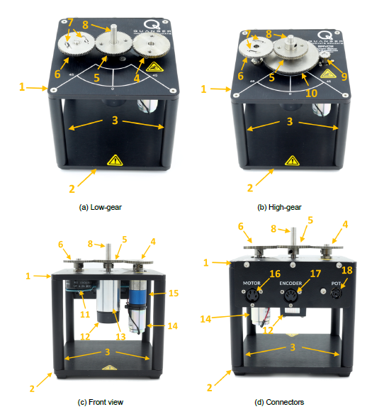
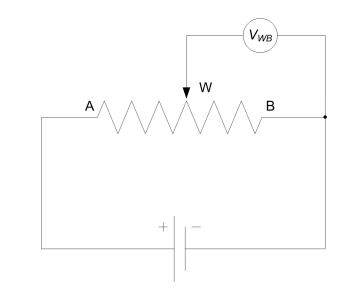
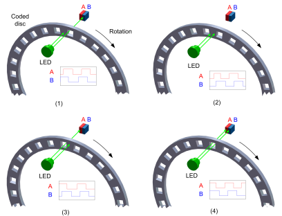
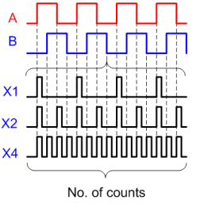
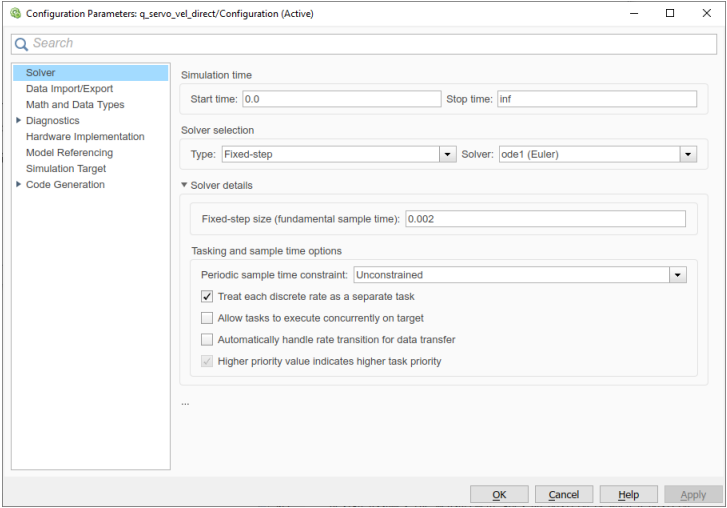
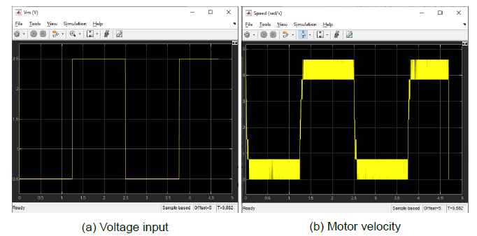
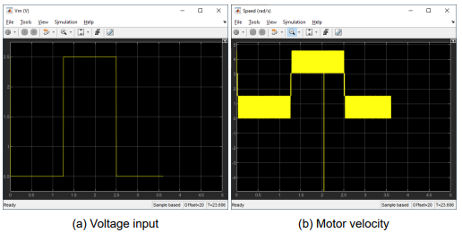
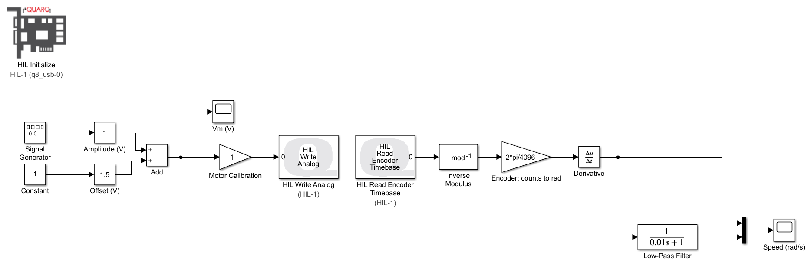
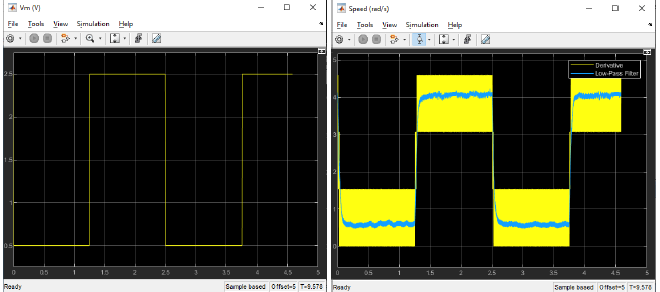

# A. Integration (Week 1)


There are two pre-lab calculations (Integration and Modelling) that need to be done before coming for the Lab 1 Week 1 lab session. Please write it down on paper with any necessary work. Failure to do pre-lab will result in points deduction for lab report.


## 1. QUANSER Rotary Servo Base

The Quanser Rotary Servo Base Unit rotary servo plant, shown below, consists of a DC motor that is encased in a solid aluminum frame and equipped with a planetary gearbox. The motor has its own internal gearbox that drives external gears. The Rotary Servo Base Unit is equipped with two sensors: a potentiometer and an encoder. The potentiometer and the encoder sensors measure the angular position of the load gear using different methods.

| ID | Component                               | ID | Component               |
| -- | --------------------------------------- | -- | ----------------------- |
| 1  | Top plate                               | 12 | Encoder                 |
| 2  | Bottom plate                            | 13 | Ball-bearing block      |
| 3  | Posts                                   | 14 | Motor                   |
| 4  | Motor pinion gear: 72-teeth (low-gear)  | 15 | Motor Gearbox           |
| 5  | Load gear: 72 teeth (low-gear)          | 16 | Motor connector         |
| 6  | Potentiometer gear                      | 17 | Encoder connector       |
| 7  | Anti-backlash springs                   | 18 | Potentiometer connector |
| 8  | Load shaft (i.e. output shaft)          | 19 | Bar inertial load       |
| 9  | Motor pinion gear: 24-teeth (high-gear) | 20 | Disc inertial load      |
| 10 | Load gear: 120-teeth (high-gear)        | 21 | Thumb screws            |
| 11 | Potentiometer                           |    |                         |

## 2. Components & Sensors

### a) DC Motor

The Rotary Servo Base Unit incorporates a Faulhaber Coreless DC Motor model 2338S006 and is shown in Figure 1c with ID #9. This is a high-efficiency, low-inductance motor that can obtain a much faster response than a conventional DC motor.

### b) Potentiometer

A rotary potentiometer, or pot, is a manually controlled variable resistor. See the example shown below. It typically consists of an exposed shaft, three terminals (A, W, and B), an encased internal resistive element shaped in a circular pattern, and a sliding contact known as a wiper. By rotating the shaft, the internal wiper makes contact with the resistive element at different positions, causing a change in resistance when measured between the centre terminal (W) and either of the side terminals (A or B). The total resistance of the potentiometer can be measured by clamping a multimeter to terminals A and B.

.png>)

A schematic diagram of the voltage dividing characteristic of a potentiometer is illustrated below. By applying a known voltage between terminals A and B ($$V_{AB}$$), voltage is divided between terminals AW and WB where:

$$
V_{AB} = V_{AW} + V_{WB}
$$

When connected to an external shaft, a rotary potentiometer can measure absolute angular displacement. By applying a known voltage to the outside terminals of the pot, we can determine the position of the sensor based on the output voltage $$V_{AW}$$ or $$V_{WB}$$ which will be directly proportional to the position of the shaft. \
\
One of the advantages of using a potentiometer as an absolute sensor is that after a power loss, position information is retained since the resistance of the pot remains unchanged. While pots are an effective way to obtain a unique position measurement, caution must be used since their signal output may be discontinuous. That is, after a few revolutions potentiometers may reset their signal back to zero. Another disadvantage of most pots is that they have physical stops that prevent continuous shaft rotation.

### c) Encoders

An incremental optical encoder is a relative angular displacement sensor that measures angular displacement relative to a previously known position. Unlike an absolute encoder, an incremental encoder does not retain its position information upon power loss. An incremental encoder outputs a series of pulses that correlate to the relative change in angular position. Encoders are commonly used to measure the angular displacement of rotating load shafts. The information extracted from an incremental encoder can also be used to derive instantaneous rotational velocities.

An incremental optical encoder typically consists of a coded disk, an LED, and two photo sensors. The disk is coded with an alternating light and dark radial pattern causing it to act as a shutter. As shown schematically above, the light emitted by the LED is interrupted by the coding as the disk rotates around its axis. The two photo sensors (A and B) positioned behind the coded disk sense the light emitted by the LED. The process results in A and B signals, or pulses, in four distinct states: (1) A off, B on; (2) A off, B off; (3) A on, B off; (4) A on, B on. \
\
Encoders that output A and B signals are often referred to as **quadrature encoders** since the signals are separated in phase by 90◦. The resolution of an encoder corresponds to the number of light or dark patterns on the disk and is given in terms of pulses per revolution, or PPR. In order to make encoder measurements, you need to connect the encoder to a counter to count the A and B signals. Then use a decoder algorithm to determine the number of counts and direction of rotation. Three decoding algorithms are used: X1, X2, X4.

**X1 Decoder:** When an X1 decoder is used, only the rising or falling edge of signal A is counted as the shaft rotates. When signal A leads signal B, the counter is incremented on the rising edge of signal A. When signal B leads signal A, the counter is decremented on the falling edge of signal A. Using an X1 decoder, a 1,024 PPR encoder will result in a total of 1,024 counts for every rotation of the encoder shaft. \
\
**X2 Decoder:** When an X2 decoder is used, both the rising and falling edges of signal A are counted as the shaft rotates. When signal A leads signal B, the counter is incremented on both the rising and falling edge of signal A. When signal B leads signal A, the counter is decremented on both the rising and falling edges of signal A. Using an X2 decoder, a 1,024 PPR encoder will generate a total of 2,048 counts for every rotation of the encoder shaft. \
\
**X4 Decoder:** When an X4 algorithm is used, both the rising and falling edges of both signals A and B are counted. Depending on which signal leads, the counter will either increment or decrement. An X4 decoder generates four times the number of counts generated by an X1 decoder resulting in the highest resolution among the three types of decoders. Using an X4 decoder, a 1,024 PPR encoder will generate a total of 4,096 counts for every rotation of the encoder shaft.

The angular resolution of an encoder depends on the encoder’s pulses per revolution (PPR) and the decoding algorithm used:

$$
\Delta \theta = \frac{2\pi}{N\times PPR} \qquad \qquad \qquad \tag{1.1}
$$

where N = 1, 2, or 4 corresponds to X1, X2, and X4 decoders respectively

## 3. Velocity Estimation

While encoders are typically used for measuring angular displacement, they can also measure rotational speeds. The velocity can be found by taking the difference between consecutive angle measurements

$$
\omega (k) = \frac{\theta(k) - \theta(k-1)}{h}
$$

​where $$\theta(k)$$ represents the $$k^{th}$$ position measurement sample and $$h$$ is the sampling interval of the control software. The resolution or ripple in the velocity measurement is given by

$$
\Delta\omega = \frac{\Delta \theta}{h} \qquad \qquad \qquad \tag{1.2}
$$

$$\omega$$ is rotational speed (rad/s) and $$\Delta \theta$$ is the resolution of the encoder given in Equation 1.1, and $$h$$ is the sampling interval. Note that the ripple velocity increases when the sampling period decreases.

## 4. Filtering the Velocity Signal

In practice, determining rotational speeds by means of derivation of the discontinuous encoder output often results in signal noise. The ripple in the velocity signal due to sampling can be reduced by filtering. Applying a first-order low-pass filter to the measured velocity signal

$$
\frac{Y_f(s)}{Y} = \frac{1}{T_f(s) + 1}
$$

​where $$Y$$ is the measured signal, $$Y_f$$ is the filtered signal, and $$T_f$$ is the filter time constant. Low-pass filters are also often represented in terms of cutoff frequency $$\omega_f$$:

$$
\frac{Y_f(s)}{Y} = \frac{\omega_f}{s+\omega_f}
$$

where $$\omega_f = 1 / T_f$$ . The low-pass filter attenuates the high-frequency components of the signal higher than the cut-off frequency specified, i.e. passes signal with frequencies $$\omega \leq \omega_f .$$

Rearranging the filter transfer function above,

$$
sT_fY_f(s) + Y_f(s) = Y(s)
$$

we can represent the filtering using the differential equation

$$
T_f \frac{dy_f(t)}{dt} + y_f(t) = y(t)
$$

​The derivative can be approximated by the difference between the currently measured sample, $$y_f(t)$$, and the previous sample, $$y_f(t − h)$$:

$$
T_f\frac{y_f(t) - y_f(t-h)}{h}+y_f(t) = y(t)
$$

​Solving for $$y_f(t)$$,

$$
y_f(t) = \frac{T_f}{T_f + h}y_f(t-h)+\frac{h}{T_f + h}y(t) \qquad \qquad \qquad \tag{1.3}
$$

Thus the high-frequency error is reduced by a factor of $$h/(T_f + h)$$. The ripple in the filtered velocity signal caused by the encoder is

$$
\Delta y_f(t) = \frac{h}{T_f + h} \frac{\Delta \theta}{h} \qquad \qquad \qquad \tag{1.4}
$$


**Note:** Filtering does add dynamics to the signal, i.e. small delay, as given by the term $$\frac{T_f}{T_f + h}y_f (t-h)$$ in Equation 1.3.


## 5. Encoder Counter Wrapping

Encoder counters on data acquisition (DAQ) devices have a rated number of bits, n. For example, a DAQ with an 8-bit signed counter has a range between −128 and +127 (i.e. $$-2^{7}$$ and $$2^7-1$$). When the encoder counts go beyond this range, the measured counts from the DAQ ends up wrapped_._ \
\
Consider the following example. If the encoder is measuring 100 counts, then the DAQ counter will output 100 (no wrapping). However, if the encoder is measuring 150 counts, then the 8-bit signed counter will read $$(150+128) \mod 256 ~ − ~128 = −106$$ counts. Thus the encoder wraps and causes a discontinuity. This can be very problematic in closed-loop feedback control. The QUARC software includes an Inverse Modulus block that unwraps the counter signal and keeps a continuous signal. For more information, see the Inverse Modulus block in the QUARC documentation.

## Pre-lab (before lab start)

#### <mark style="background-color:orange;">Do Problem 1 \~ 5</mark>&#x20;

1. Given that the Rotary Servo Base Unit rotary encoder has 1024 PPR and the quadrature decoding is used in the DAQ, what is the resolution of the encoder?
2. What is the sensor gain for the rotary potentiometer that converts voltage measured into load gear angle (in radians)?\
   \
   Sensor Gain is used to convert output signal to desired output unit. For the potentiometer the output ranges from -5V to +5V. In this case, the sensor gain converts voltage into corresponding radians.\
   \
   **Information**: the rotary potentiometer on the Rotary Servo Base Unit outputs ±5 V over 352 deg.
3. Assuming the DAQ device you are using has a 16-bit signed encoder counter. What is the counter range and how does that affect the measuring encoder signal?\

4. Find the velocity estimation ripple of the Rotary Servo Base Unit when the sampling interval is 0.01 s, 0.002 s, and 0.001 s. How does increasing the sampling rate (i.e., decreasing the sampling interval) affect the ripple?
5. A low-pass filter with a time constant of $$T_f = 0.01$$ is used in the velocity estimator and the sampling of the control runs at $$h = 0.001$$s. Evaluate the ripple in the velocity with this filter.

## ↓↓↓ In Lab Exercise ↓↓↓

## Experiment

We have tried a simple SIMULINK model diagram of the Rotary Servo Base with encoder and potentiometer reading from Lab 0 QLabs. This time we will build a SIMULINK model from scratch to read the motor velocity using actual equipment.

Follow the steps and build the SIMULINK model below:

Follow these steps to read the motor velocity:



1. First, download and open q\_servo\_vel\_direct.slx __ Simulink model.
2. Configure the model to apply a 0.4 Hz square wave voltage signal going between 0.5V and 2.5V.
3. Change the simulation time to 5 seconds from Simulation tab, stop time.
4.  Go to Modelling tab and open modelling setting. Check that sample time is set to 0.002s and check that solver is set to ode1 (euler).\

    <figure><figcaption></figcaption></figure>
5. To build the model, click the down arrow on **Monitor & Tune** under the Hardware tab and then click **Build** **for monitoring** .png>). This generates the controller code.
6. Click **Connect**  button under **Monitor & Tune** and then run SIMULINK by clicking **Start** .
7.  The velocity measurement using a direct derivative will be noisy. After the SIMULINK has run for 5 seconds and stopped, **measure the velocity ripple (peak to peak within ripple)**. You can use the Cursor Measurements tool in the Scope for more accurate measurements. \
    \
    <mark style="background-color:blue;">Result:</mark> compare the measured ripple to the calculation made in Pre-Lab Q4 with sampling interval of 0.002s.\
    \
    Save the speed data (wl) to plot in the report. Name the file such as integration\_sampletime0.002s.\
    \

    <figure><figcaption>
Sample velocity estimate usign direct derivative when running at 500 Hz
</figcaption></figure>

8. Increase the control loop rate of the QUARC controller by decreasing the sampling interval to 0.001 s, i.e. increasing the sampling rate to 1 kHz. Build, Connect and run the Simulink. Once SIMULINK has run for 5 seconds and stopped, examine the change in the ripple velocity measurement. \
   \
   <mark style="background-color:blue;">Result:</mark> compare the measured ripple to the calculation made in Pre-lab Q4 with sampling interval of 0.001s.\
   \
   Save the speed data (wl) to plot in the report. Name the file such as integration\_sampletime0.001s.
9.  Run the controller for a minute or two (stop time to inf). Depending on the data acquisition device you are using (e.g. Q2-USB or Q8-USB), you may notice a spike or discontinuity that occurs in the velocity estimation, as shown below (once the discontinuity occurs stop the simulation) :\
    \
    This encoder wrapping is due to the range of the DAQ encoder counter. To remove the wrapping and maintain a continuous signal, use the QUARC Inverse Modulus block before Encoder: count to rad block. Build, connect and run your QUARC controller and ensure the signal is now continuous (i.e. no spike occurs).\
    \
    **Note** : The Inverse Modulus block should be added to the output of the HIL Read Encoder and set to the $$2^n$$ where n is the bits of the DAQ encoder counter. Quanser Q2-USB has 16-bit encoder counter and Quanser Q8-USB has 24-bit encoder counter.

    <figure><figcaption></figcaption></figure>

    Save the speed data (wl) to plot in the report. Name the file such as integration\_wrapping.\

10. Add a low-pass filter with a time constant of $$T_f = 0.01$$s using the Simulink Transfer Fcn block. This translate into having a filter with a cutoff frequency of 1/0.01 = 100 rad/s. Run it for 5 seconds.\
    \

    <figure><figcaption></figcaption></figure>

    Save the speed data (wl) to plot in the report. Name the file such as integration\_lowpass.\
    \

    <figure><figcaption></figcaption></figure>

    \
    <mark style="background-color:blue;">Result:</mark> Compare the velocity estimation using the direct derivative with filtering. How much noise does the filter remove? Is this in-line with the ripple velocity calculated in Pre-lab Q5? \
    \
    <mark style="background-color:blue;">Result:</mark> Attach the response of the filtered velocity estimate and the Simulink model you designed.

## Results For Report

1. Pre-lab calculations.
2. Complete SIMULINK block diagram with low-pass filter.
3. Response plots from In-Lab Experiment Step 7,8,9 and 10. Comparison between measured and calculated values.
4. Answer all the questions asked in the In-Lab experiment.
