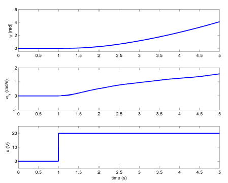
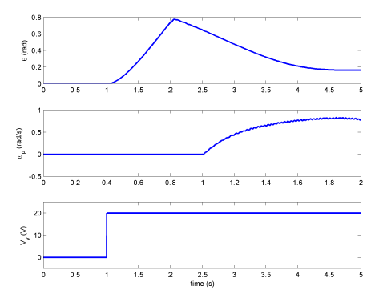

# 2DOF Helicopter

## Introduction

The Quanser Aero Experiment can be configured as a conventional dual-rotor helicopter, as shown in Figure 1. The front rotor that is horizontal to the ground predominantly affects the motion about the pitch axis while the back or tail rotor mainly affects the motion about the yaw axis (about the shaft).

.png>)

The tail rotor in helicopters is also known as the anti-torque rotor because it is used to reduce the torque that the main rotor generates about the yaw. Without this, the helicopter would be difficult to stabilize about the yaw axis. Because the rotors on the Quanser Aero Experiment are the same size and equidistant from each other, the tail rotor also generates a torque about the pitch axis. As a result, both the front and back/tail rotors generate a torque on each other.

## Background

### Equations of Motion

The free-body diagram of the Quanser Aero Experiment is illustrated in Figure 2.

.png>)

The following conventions are used for the modeling:

* The helicopter is horizontal and parallel with the ground when the pitch angle is zero, i.e., $$\theta=0$$ .
* The pitch angle increases positively, $$\dot{\theta}(t)>0$$ , when the front rotor is moved upwards and the body rotates clockwise (CW) about the Y axis.
* The yaw angle increases positively, $$\dot{\psi}(t)>0$$ , when the body rotates counter-clockwise (CCW) about
  &#x20;the Z axis.
* Pitch increases, $$\dot{\theta}>0$$ , when the front rotor voltage is positive $$V_\theta>0$$ .
* Yaw increases, $$\dot{\psi}>0$$ , when the back (or tail) rotor voltage is positive, $$V_{\psi}>0$$ .

When voltage is applied to the pitch motor, $$V_\theta$$ , the speed of rotation results in a force, $$F_\theta$$ that acts normal to the body at a distance $$r_\theta$$ from the pitch axis. The rotation of the propeller generates a torque about the pitch rotor motor shaft which is in turn seen about the yaw axis. Thus, rotating the pitch propeller does not only cause motion about the pitch axis but also about the yaw axis. As described earlier, that is why conventional helicopters include a tail, or anti-torque, rotor to compensate for the torque generated about the yaw axis by the large, main rotor.

Similarly, the yaw motor causes a force $$F_\psi$$ that acts on the body at a distance $$r_\psi$$  from the yaw axis as well as a torque about the pitch axis.

The equations of motion can be approximated after neglecting reaction torques from the rotors:

&#x20;                                                                 $$J_\theta\ddot{\theta}+D_\theta\dot{\theta}+K_\theta\theta=\tau_\theta \tag{1}$$                                                                   &#x20;

$$J_\psi\ddot{\psi}+ D_\psi\dot{\psi}=\tau_\psi \tag{2}$$​

where the torques acting on the pitch and yaw axes are &#x20;

&#x20;                                                                                      $$\tau_\theta = K_{\theta \theta} V_{\theta} + K_{\theta \psi} V_{\psi} \tag{3}$$

$$\tau_\psi = K_{\psi \theta} V_{\theta} + K_{\psi \psi} V_{\psi} \tag{4}$$​

The parameters used in the EOMs above are:

* $$J_\theta$$ : the total moment of inertia about the pitch axis
* $$D_\theta$$ : the damping about the pitch axis
* $$K_\theta$$ : the stiffness about the pitch axis
* $$J_{\psi}$$ : the total moment of inertia about the yaw axis
* $$D_{\psi}$$ : the damping about the pitch axis
* $$K_{\theta\theta}$$ : torque thrust gain from the pitch rotor
* $$K_{\psi\psi}$$ : torque thrust gain from the yaw rotor
* $$K_{\theta\psi}$$ : cross-torque thrust gain acting on the pitch from the yaw rotor
* $$K_{\psi\theta}$$ : cross-torque thrust gain acting on the yaw from the pitch rotor
* $$V_\theta$$ : voltage applied to the pitch rotor
* $$V_\psi$$ : voltage applied to the yaw rotor motor

The total moment of inertia acting about the pitch and yaw axes are

&#x20;                                                                           $$J_\theta=J_{\rm body}+2J_{\rm prop} \tag{5}$$                                                                 &#x20;

&#x20;                                                                     $$J_\psi=J_{\rm body}+2J_{\rm prop}+J_{\rm yoke} \tag{6}$$                                                      &#x20;

Expressing the rotor as a single-point mass, the inertia acting about the pitch or yaw axis from a single
&#x20;rotor  is $$J_{\rm prop}=m_{\rm prop}r^2$$ . Modeling the helicopter body as a cylinder rotating about its center, the  inertia
&#x20;is $$J=m_{\rm body} \displaystyle  \frac{L^2_{\rm body}}{12}$$. Finally, the forked yoke that rotates about the yaw axis can be approximated as
&#x20;a cylinder rotating about its center as well and expressed as $$J_{\rm yoke}=m_{\rm yoke}\displaystyle \frac{r^2_{yoke}}{2}$$. Evaluating the moment of inertia using the parameters listed in the Quanser Aero Experiment User Manual gives:

$$
J_\theta=0.0219 \space \rm kg \cdot m^2
$$

$$
J_\psi=0.0220\space \rm kg \cdot m^2
$$

### **First-Order Response**

The step response of a first-order transfer function

&#x20;                                                                            $$Y(s) = \displaystyle \frac{K}{\tau s+1}U(s) \tag{7}$$                                                                    &#x20;

where K is the DC or steady-state gain and τ is the time constant as illustrated in Figure 3. This is for a
&#x20;system with $$K = 1$$ and $$\tau = 0.05$$.

To obtain the time constant from the response, find the time it takes to reach $$1-e^{-1}$$or 63% of its
&#x20;final steady-state value:

$$y(t_1)=y_1=(1-e^{-1})(y_{\rm ss}-y_0) \tag{8a}$$

The time constant is $$\tau=t_1-t_{0 }$$, where $$t_0$$ is the start time of the step and $$t_1$$ is the time it takes to reach
&#x20;63% of the final value, as illustrated in Figure 3.

.png>)

To find the time constant from first-order response from an impulse (or short step) as depicted in Figure 4, find the time it takes for the response to reach $$e^{-1}$$ or 37% of its final steady-state value.&#x20;

In this case we need to find&#x20;

$$y(t_1)=y_1=e^{-1}(y_0 - y_{\rm ss}) \tag{8b}$$

and the time constant is $$\tau=t_1-t_{0 }$$

<figure><figcaption>
Figure 3.b: First-order impulse decaying response
</figcaption></figure>

### Second-Order Response

The free-oscillatory equation of motion of a second-order system is described by

&#x20;                                                                      $$J\ddot{\alpha}+D\dot{\alpha}+K\alpha =0 \tag{9}$$                                                    &#x20;

is shown in Figure 4. Assuming the initial conditions $$\alpha(0-)=\alpha_0$$, the Laplace transform of Equation (9)
&#x20;is                    $$\alpha(s)=\displaystyle{\frac{\alpha_0/J}{s^2+D/Js+K/J}}   \tag{10}$$                                                            &#x20;

The prototype second-order equation is defined

$$s^2+2\zeta\omega_ns+\omega_n^2 \tag{11}$$    &#x20;

where $$\zeta$$ is the damping ratio and $$\omega_n$$ is the natural frequency. Equating the characteristic equation in
&#x20;Equation (10) to this gives

$$\omega_n^2=\displaystyle\frac{K}{J}\tag{12}$$​

$$2\zeta\omega_n=\displaystyle\frac{D}{J} \tag{13}$$

#### Finding the Natural Frequency

The period of the oscillations in a system response can be found using the equation

&#x20;                                                                                $$T_{\rm osc}=\displaystyle\frac{t_n-t_1}{n-1} \tag{14}$$                                                                           &#x20;

where $$t_n$$ is the time of the $$n^{th}$$ oscillation, $$t_1$$ is the time of the first peak, and $$n$$ is the number of
&#x20;oscillations considered. From this, the damped natural frequency (in radians per second) is

&#x20;                                                                                 $$\omega_d=\displaystyle \frac{2\pi}{T_{\rm osc}} \tag{15}$$                                                                             &#x20;

and the undamped natural frequency is

&#x20;                                                                             $$\omega_n=\displaystyle\frac{\omega_d}{\sqrt{1-\zeta^2}} \tag{16}$$                                                                           &#x20;

#### Finding the Damping Ratio&#xD;

The damping ratio of a second-order system can be found from its response. For a typical second-order
&#x20;underdamped system, the subsidence ratio (i.e. decrement ratio) is defined as

&#x20;                                                                            $$\delta = \displaystyle\frac{1}{n-1}\ln\frac{O_1}{O_n} \tag{17}$$&#x20;

.png>)

where $$O_1$$ is the peak of the first oscillation and $$O_n$$ is the peak of the $$n^{th}$$ oscillation. Note that $$O_1$$ > $$O_n$$ ,
&#x20;as this is a decaying response. The damping ratio can then be found using

&#x20;                                                                              $$\zeta= \displaystyle\frac{\delta}{\sqrt{4\pi^2+\delta^2}} \tag{18}$$                                                                          &#x20;

### Estimating the Viscous Damping Coefficients&#xD;

The viscous damping coefficients acting about the pitch and yaw axes, $$D_\theta$$ and $$D_\psi$$ in Equation (1)
&#x20;and Equation (2), can be found from the free-oscillation response. The free-oscillation response about the
&#x20;pitch and about the yaw are different, however.
&#x20;

**Pitch Axis:** By locking the yaw axis (using the Allen key supplied), this allows us to focus on the
&#x20;1 DOF pitch-only system. Apply a short step voltage to mimic an impulse and get the free-oscillation
&#x20;response of the pitch. Remark that the impulse response is second-order free-oscillation response. The
&#x20;resulting 1 DOF pitch-only equations of motion is

&#x20;                                                               $$J_\theta\ddot{\theta}+D_\theta\dot{\theta}+K_\theta\theta=0 \tag{19}$$                                                               &#x20;

Taking its Laplace transform gives

&#x20;                       $$J_\theta\left(\Theta(s)s^2-\theta(0^-)-\dot{\theta}(0^-)\right)+D_\theta\left(\Theta(s)-\theta(0^-)\right)+K_\theta\Theta(s)=0 \tag{20}$$                  &#x20;

Assuming the initial velocity is zero, $$\dot{\theta}(0^-)=0$$, and solving for position we get

&#x20;                                          $$\Theta(s)=\displaystyle\frac{J_\theta}{J_\theta s^2+D_\theta s+K_\theta}\theta(0^-)=\frac{J_\theta D_\theta}{s^2+D_\theta/J_\theta +K_\theta/J_\theta}\theta(0^-) \tag{21}$$                                   &#x20;

The pitch free-oscillation transfer function matches the prototype second-order transfer function in Equation (10) Based on the measured damping ratio and natural frequency of the response, the friction (or
&#x20;stiffness) of the system is

&#x20;                                                                             $$K_\theta=J_\theta\omega_n^2 \tag{22}$$                                                                             &#x20;

and the viscous damping is

&#x20;                                                                            $$D_\theta=2\zeta\omega_nJ_\theta \tag{23}$$                                                                         &#x20;

**Yaw Axis:** The 1 DOF yaw-only equations of motion is

$$J_\psi\ddot\psi+D_\psi\dot\psi=0 \tag{24}$$

In terms of angular rate, the equation becomes

&#x20;                                                                     $$J_\psi\dot\omega_\psi(t)+D_\psi\omega_\psi(t)=0 \tag{25}$$                                                          &#x20;

where $$\omega_\psi(t)=\dot{\psi}(t)$$ . Taking its Laplace transform

&#x20;                                                        $$J_\theta(\Omega_\psi(s)s-\omega_\psi(0^-))+D_\psi\Omega_\psi(s)=0 \tag{26}$$                                          &#x20;

and solving for the speed we get

$$\Omega_\psi(s)=\displaystyle \frac{J_\psi}{J_\psi s+D_\psi}\omega_\psi(0^-)=\frac{J_\psi/D_\psi}{J_\psi/D_\psi s+1}\omega_\psi(0^-) \tag{27}$$

&#x20;The yaw free-oscillation transfer function matches the prototype first-order transfer function in Equation (7). Based on the measured time constant of the response, its damping can be found with

&#x20;                                                                                 $$D_\psi=\displaystyle\frac{J_\psi}{\tau} \tag{28}$$                                                                              &#x20;

### Estimating the Thrust Parameters&#xD;

By locking the yaw axis, this allows us to focus on the 1 DOF pitch-only system, i.e., eliminating any
&#x20;motion introduced in the yaw axis when applying a voltage to the pitch rotor. The equations of motion
&#x20;for the 1-DOF actuated system is

&#x20;                                                               $$J_\theta\ddot\theta+D_\theta\dot\theta+K_\theta\theta=K_{\theta\theta}V_\theta \tag{29}$$                                                          &#x20;

Solving for the thrust gain we get

&#x20;                                                                         $$K_{\theta\theta}=\displaystyle \frac{J_\theta\ddot\theta+D_\theta\dot\theta+K_\theta\theta}{V_\theta} \tag{30}$$                                                                 &#x20;

Remark that this is the thrust torque gain parameter. To force thrust gain would be $$K_{\theta\theta}/r_p$$, where $$r_p$$is
&#x20;the distance between the helicopter pivot and the center of the pitch rotor.
&#x20;Similarly, to find the thrust gain acting on the yaw axis only system, lock the pitch axis, and apply a
&#x20;voltage to the tail rotor. This system is represented by

&#x20;                                                                       $$J_\psi\ddot\psi+D_\psi\dot\psi=K_{\psi\psi}V_\psi \tag{31}$$                                                           &#x20;

or,

&#x20;                                                                      $$J_\psi\dot\omega_\psi+D_\psi\omega_\psi=K_{\psi\psi}V_\psi \tag{32}$$                                                        &#x20;

where $$\omega_\psi=\dot\psi$$ is the angular rate of the yaw axis. The yaw torque thrust gain is

&#x20;                                                                             $$K_{\psi\psi}=\displaystyle\frac{J_\psi\dot\omega_\psi+D_\psi\omega_\psi}{V_\psi} \tag{33}$$                                                               &#x20;

The cross-torque thrust parameters, $$K_{\theta\psi}$$and $$K_{\psi\theta}$$in Equation (3) and (4), represent the coupling between the
&#x20;axes. To find the cross-torque acting on the pitch axis from a torque applied to the tail rotor, unlock both
&#x20;pitch and yaw axes such that it is free to move in 2 DOF, apply a voltage to the tail rotor, and examine
&#x20;the response of the pitch. The equations representing these dynamics when $$V_\theta=0$$ , are

&#x20;                                                                     $$J_\theta\ddot\theta+D_\theta\dot\theta+K_\theta\theta=K_{\theta\psi}V_\psi \tag{34}$$                                                   &#x20;

Putting this in terms of angular rate, $$\omega_p=\dot\theta$$, and solving for the gain we get

&#x20;                                                                                $$K_{\theta\psi}=\displaystyle\frac{J_\theta\dot\omega_\theta+D_\theta\omega_{\theta}}{V_\psi} \tag{35}$$                                                               &#x20;

Similarly, to identify the cross-torque gain parameter that is generated about the yaw axis from a pitch
&#x20;torque (i.e. voltage applied to the front rotor), we have the equation

&#x20;                                                                          $$J_\psi\ddot\psi+D_\psi\dot\psi=K_{\psi\theta}V_\theta \tag{36}$$                                                          &#x20;

and the gain can be found using

&#x20;                                                                             $$K_{\psi\theta}=\displaystyle\frac{J_{\psi}\dot\omega_\psi+D_\psi\omega_{\psi}}{V_\theta} \tag{37}$$                                                             &#x20;

## Week 1: System Identification

### Experimental Steps for Finding System Parameters

First download the zip file below and extract it in the desktop:



#### 1. Finding Pitch Damping, $$D_{\theta}$$

1\) Lock the yaw axis to enable motions about the pitch axis only. (place the allen key to lock yaw axis and make sure that the pitch axis is free to rotate, loosen two screws)

2\) Open the _q\_aero\_free\_osc\_response\_pitch SIMULINK file._

3\) Select a (-20) V impulse

4\) Select simulation time 30 sec.

5\) To build the model, click the down arrow on **Monitor & Tune** under the Hardware tab and then click **Build** **for monitoring** .png>). This generates the controller code.

6\) Click **Connect**  button under **Monitor & Tune** and then run SIMULINK by clicking **Start** .

7\) Copy _`aero_pitch_free_osc_rsp.mat`_ to your folder. \
\
Data is saved in following order:\
1: Time (s) \
2: Pitch input (V) \
3: Pitch position (rad) \
4: Pitch speed (rad/s) \
5: Pitch acceleration (rad/s^2)

8\) Close the SIMULINK model. DO NOT SAVE THE CHANGE

#### 2. Finding Pitch thrust gain, $$K_{\theta\theta}$$&#x20;

1\) Open the _q\_aero\_step\_response\_pitch SIMULINK file._

2\) Select a step voltage 10V, (amplitude to 10)

3\) Select simulation time 30 sec.

4\) To build the model, click the down arrow on **Monitor & Tune** under the Hardware tab and then click **Build** **for monitoring** .png>). This generates the controller code.

5\) Click **Connect**  button under **Monitor & Tune** and then run SIMULINK by clicking **Start** .

6\) Copy _`aero_pitch_step_rsp.mat`_ to your folder.\
\
Data is saved in following order: \
1: Time \
2: Pitch input (V) \
3: Pitch position (rad) \
4: Pitch Speed (rad/s)

7\) Close the SIMULINK model. DO NOT SAVE THE CHANGE.

Plot below used 20V which caused heli to hit the base. This is seen as the bump at 2.4 sec. However, we used only 10V so sample plots may be different.

<figure><figcaption>
Fig. 6: Sample Pitch Step Response
</figcaption></figure>

#### 3. Finding Yaw Damping , $$D_{\psi}$$

1\) Unlock the yaw axis

2\) Lock the pitch axis

3\) Open the _q\_aero\_free\_osc\_response\_yaw SIMULINK file._

4\) Apply an impulse of 20V to the tail rotor

5\) Select simulation time 10 sec.

6\) To build the model, click the down arrow on **Monitor & Tune** under the Hardware tab and then click **Build** **for monitoring** .png>). This generates the controller code.

7\) Click **Connect**  button under **Monitor & Tune** and then run SIMULINK by clicking **Start** .

8\) Copy _`aero_yaw_free_osc_rsp.mat`_ to your folder\
\
Data is saved in following order: \
1: Time (s) \
2: Yaw input (V) \
3: Yaw position (rad) \
4: Yaw speed (rad/s) \
5: Yaw acceleration (rad/s^2)\

9\) Close the SIMULINK model. DO NOT SAVE THE CHANGE.

<figure><figcaption>
Fig. 7: Sample free response about yaw
</figcaption></figure>

#### 4. Finding Yaw thrust gain, $$K_{\psi\psi}$$&#x20;

1\) Open the _q\_aero\_step\_response\_yaw SIMULINK file._

2\) Select a step voltage 15V

3\) Select simulation time 40 sec.

4\) To build the model, click the down arrow on **Monitor & Tune** under the Hardware tab and then click **Build** **for monitoring** .png>). This generates the controller code.

5\) Click **Connect**  button under **Monitor & Tune** and then run SIMULINK by clicking **Start** .

6\) Copy _`aero_yaw_step_rsp.mat`_ to your folder\
\
Data is saved in following order: \
1: Time \
2: Yaw input (V) \
3: Yaw position (rad) \
4: Yaw Speed (rad/s)\

7\) Close the SIMULINK model. DO NOT SAVE THE CHANGE.

<figure><figcaption>
Fig. 8: Sample yaw Step Response
</figcaption></figure>

#### 5. Identifying the cross-torque gain parameter $$K_{\theta\psi}$$&#xD;

1\) Unlock both the pitch and yaw axes to enable the full 2 DOF motion.

2\) Open the _q\_aero\_step\_response\_pitch\_from\_yaw SIMULINK file._

3\) Select yaw step voltage to 12V and pitch to 0V.

4\) Select simulation time 40 sec.

5\) To build the model, click the down arrow on **Monitor & Tune** under the Hardware tab and then click **Build** **for monitoring** .png>). This generates the controller code.

6\) Click **Connect**  button under **Monitor & Tune** and then run SIMULINK by clicking **Start** .


A pitch up motion must be seen due to torque from the tail rotor.


7\) Copy _`aero_pitch_from_yaw_step_rsp.mat`_ to your folder\
\
Data is saved in following order: \
1: Time (s)\
2: Yaw input (V) \
3: Pitch Position (rad) \
4: Pitch Speed (rad/s)\

8\) Close the SIMULINK model. DO NOT SAVE THE CHANGE.

<figure><figcaption>
Fig. 9: Sample Pitch Step Response from Yaw Voltage
</figcaption></figure>

#### 6. Identifying the cross-torque gain parameter $$K_{\psi\theta}$$&#xD;

1\) Open the _q\_aero\_step\_response\_yaw\_from\_pitch SIMULINK file._

2\) Select pitch step voltage to 12V and yaw to 0V.

3\) Select simulation time 40 sec.

4\) To build the model, click the down arrow on **Monitor & Tune** under the Hardware tab and then click **Build** **for monitoring** .png>). This generates the controller code.

5\) Click **Connect**  button under **Monitor & Tune** and then run SIMULINK by clicking **Start** .


A yaw motion must be seen due to torque from front motor.


6\) Copy _`aero_yaw_from_pitch_step_rsp.mat` _ to your folder\
\
Data is saved in following order: \
1: Time (s) \
2: Pitch input (V) \
3: Yaw Position (rad) \
4: Yaw Speed (rad/s)

7\) Close the SIMULINK model. DO NOT SAVE THE CHANGE.

### Analysis (should be done before week 2 and Controller design)

1.  Find the **natural frequency** and **damping ratio** from the impulse response of the **pitch axis** (HINT: first find the peaks and use equation 16, 17, and 18). Then find the **stiffness** and **viscous damping coefficient** about the **pitch axis** (Hint: equation 22,23).

2. Find the **time constant** from the **yaw pulse** response and obtain the **damping** $$D_\psi$$. Use First-order impulse decaying response. To find the time constant, examine the decaying response that starts at an initial maximum speed and settle down to 0 rad/s (use equation 8b). If data obtained does not fully shows the 37% try estimate the value by curve fitting.\

3. Find the **thrust** and **cross-torque thrust gain** parameters $$K_{\theta\theta}, K_{\psi\psi}, K_{\theta\psi}, K_{\psi\theta}$$ by performing discrete derivative to peak values or from the steady state of step response.

## (Before week 2) Controller Design

### Background

#### Linear State-Space Representation

Given the linear state-space equations: $$\dot{x}=Ax+Bu$$ and $$y=Cx+Du$$, we define the state for the
&#x20;Quanser Aero Experiment as

&#x20;                                                            $$x=\begin{bmatrix} \theta(t), & \psi (t), & \dot{\theta}(t), & \dot\psi(t) \end{bmatrix}^T \tag{38}$$                                               &#x20;

the output vector as                       $$y= \begin{bmatrix} \theta(t), & \psi(t), & \dot{\theta}(t), & \dot{\psi}(t) \end{bmatrix}^T \tag{39}$$                                                                 &#x20;

and the control variables as

$$u=\begin{bmatrix} V_\theta & V_\psi\end{bmatrix}^T \tag{40}$$                                                                &#x20;

where $$\theta$$and $$\psi$$are the pitch and yaw angles, respectively,  and $$V_\theta$$and $$V_\psi$$ are the motor voltages applied to the pitch and yaw rotors (i.e. the main and tail rotors). Using the equations of motion in Equations (1) and (2), the state-space matrices are

$$A=\begin{bmatrix} 0&0&1&0\\ 0 &0&0&1\\ -K_{\theta}/J_\theta & 0& -D_\theta/J_\theta& 0 \\ 0 &0 &0&-D_\psi/J_\psi \end{bmatrix} \tag{41.a}$$​

$$B=\begin{bmatrix} 0& 0\\ 0&0\\ K_{\theta\theta}/J_\theta & K_{\theta\psi}/J_\theta \\ K_{\psi\theta}/J_{\psi} & K_{\psi\psi}/J_\psi \end{bmatrix} \tag{41.b}$$

$$C=\begin{bmatrix} 1&0&0&0\\ 0&1&0&0  \\ 0&0&1&0 \\ 0&0&0&1\end{bmatrix} \tag{41.c}$$

$$D=\begin{bmatrix} 0&0\\ 0&0 \\ 0&0\\  0 &  0\end{bmatrix} \tag{41.d}$$                                         &#x20;

In this section, a state-feedback controller is designed to regulate the pitch and yaw angles of the Quanser Aero Experiment to desired _angles._ Using the previous state-space model, we can find a control gain  $$K$$ based on the coupled dynamics to stabilize the system. The control gains are computed using **Linear-Quadratic Regulator (LQR)** theory. The general state-feedback control is illustrated in Figure 11. The state-feedback controller is defined

.png>)

&#x20;                                                                            $$u=K(x_d-x) \tag{42}$$                                                                    &#x20;

where $$x$$ is the state defined in Equation (38)

&#x20;                                                                    $$x_d=\begin{bmatrix}\theta_d, & \psi_d, & 0,&0\end{bmatrix} ^ T\tag{43}$$                                                           &#x20;

is the reference command (or setpoint) state with the desired pitch and yaw angles, $$\theta_d$$ and $$\psi_d$$ , and

&#x20;                                                                               $$u=\begin{bmatrix} V_\theta&V_\psi\end{bmatrix} ^ T\tag{44}$$                                                                  &#x20;

is the control input where $$V_\theta$$ is the front/pitch motor voltage and $$V_\psi$$ is the tail/yaw motor voltage.


**Linear Quadratic Regulator** (LQR) optimization can be used for finding the control gain parameters
&#x20;of the Quanser Aero Experiment flight control. Given the state-space representation, the LQR algorithm
&#x20;computes a control law $$u$$ to minimize the performance criterion or cost function:$$J=\int_0^\infty(x_{\rm ref}-x(t))^TQ(x_{\rm ref}-x(t))+u(t)^TRu(t)dt. \tag{45}$$                                &#x20;

The design matrices $$Q$$ and $$R$$ hold the penalties on the deviations of state variables from their setpoint and
&#x20;the control actions, respectively. When an element of $$Q$$ is increased, therefore, the cost function **increases
&#x20;the penalty associated with any deviations from the desired setpoint of that state variable**, and thus the
&#x20;specific control gain will be larger. When the values of the $$R$$ matrix are increased, a **larger penalty is
&#x20;applied to the aggressiveness of the control action**, and **the control gains are uniformly decreased**.

Since there are four states , $$Q\in \mathbb{R}^{4\times 4}$$, and two control variables, $$R\in\mathbb{R}^{2\times 2}$$ . The setpoint, $$x_d$$ (Equation 43) is given
&#x20;above the control strategy used to minimize cost function J is thus given by

&#x20;                            $$u=K(x_d-x)=k_{p,\theta}(\theta_d-\theta)+k_{p,\psi}(\psi_d-\psi)-k_{d,\theta}\dot\theta-k_{d,\psi}\dot\psi \tag{46}$$                    &#x20;

### Designing an LQR Controller

Various control software already has LQR optimization routines that can be used to generate the state feedback control gain $$K$$. In order for the closed-loop response to satisfy certain time-domain specifications,
&#x20;the closed-loop system is typically simulated using its dynamic model, in software, first. This is an iterative
&#x20;process. By adjusting the weighting matrices $$Q$$ and $$R$$ and then running the simulation, we can find a control that satisfies the user's requirements. Further, we must ensure that the control signal $$u$$ is smooth
&#x20;(i.e. does not chatter) and does not surpass the limits of the actuator.

#### LQR Control Design and Simulation

LQR is used to find the state-feedback control gain $$K$$ ($$K$$ is $$2\times 4$$matrix) that will stabilize the Quanser Aero Experiment to the user's desired pitch and yaw angles. Our desired closed-loop response should match the following specifications. Use MATLAB command `K = lqr(A,B,Q,R)` to obtain gain, $$K$$, matrix.

#### Desired closed-loop response specifications for pitch

1.  Steady-state error: pitch $$e_{\rm ss}$$ ≤ 2 $$\deg$$, yaw $$e_{\rm ss}$$ ≤ 2 $$\deg$$.

2.  Peak time: $$t_{\rm p}$$ ≤ 2 s.

3.  Percent Overshoot: $$\rm PO$$ ≤ 7.5%.

4. No actuator saturation: $$|V_\psi|$$ ≤ 24V  and $$|V_\theta|$$ ≤ 24V .

The state-space matrices derived in Equation (41) are entered in the State-Space block in SIMULINK and the control gain is set to the MATLAB variable K.

#### Running the closed-loop state-feedback LQR simulation

1.  Using parameters from Part A, obtain state-space matrices of the system neglecting coupling effect.

2. Design $$Q,R$$ , and $$K$$. To start with try with following $$Q$$, $$R$$ and $$K$$.\
   `Q = diag([200 75 0 0 ]);` \
   `R = 0.01*eye(2,2);` \
   `K = lqr(A,B,Q,R)`\

3.  Build the SIMULINK model of the system

4.  Simulate the closed-loop response of the system with pitch-only command: $$\theta_d=10\space \deg$$. (Make sure to change deg to rad in SIMULINK)

5.  Simulate the closed-loop response of the system with yaw only command: $$\psi_d=45 \space \deg$$. (Make sure to change deg to rad in SIMULINK)

6.  Simulate the closed-loop response of the system with pitch and yaw command: $$\theta_d= 10\space \deg$$ and $$\psi_d = 45 \space \rm deg$$. (Make sure to change deg to rad in SIMULINK)

7.  Check whether your controller meets the desired specifications.

8.  If it fails to meet the specifications, tune $$Q$$ and/or $$R$$ to meet the specifications

9.  Save the data and plot the closed-loop system response for pitch and yaw

10. Now, use system matrices with coupling effect and use the controller without coupling

11. Repeat steps 4-6

12. The closed-loop response in this step does not have to meet the desired specifications

13. Now, design $$Q,R$$ , and $$K$$ with the coupling effect

14. Build the SIMULINK model of the system

15. Repeat steps 4-6

16. Check whether your controller meets the desired specifications.

17. If it fails to meet the specifications, tune $$Q$$ and/or $$R$$ to meet the specifications

18. Save the data and plot the closed-loop system response for pitch and yaw

#### Things to check

* [ ] Results from part A
  &#x20;
* [ ] System matrices neglecting the coupling effect
* [ ] System response of the system neglecting coupling effect (pitch & yaw)
* [ ] System matrices with coupling effect
* [ ] System response of the system with coupling effect (pitch & yaw)

#### Analysis

1. What happened when you neglect the coupling effect?
2. Is there any systematic way to design $$Q$$ and $$R$$ ?

## Week 2: Controller Implementation

In this section, the state-feedback control is implemented on the Quanser Aero Experiment using the q\_aero\_2dof\_lqr\_control SIMULINK diagram shown in Figure 12 with QUARC.

Download the file into the quanser\_aero folder that was used for Week 1.



.png>)

### Desired Closed-Loop Response Specifications

1. Steady-state error: pitch $$e_{\rm ss}$$ ≤ 2 $$\deg$$, yaw $$e_{\rm ss}$$ ≤ 2 $$\deg$$.
2. Peak time: $$t_{\rm p}$$ ≤ 2 s.
3. Percent Overshoot: $$PO$$ ≤ 7.5%.
4. No actuator saturation: $$|V_\psi|$$ ≤ 24V and $$|V_\theta|$$ ≤ 24V .

### Running the closed-loop state-feedback LQR simulation

### Neglecting Coupling Effect

#### Pitch Command Only

1. Unlock both pitch and yaw axes to enable the full 2 DOF motion.
2. Open _q\_aero\_2dof\_lqr\_control SIMULINK file._
3. Use the gain $$K$$ obtained in Part B. neglecting the coupling effect.
4. Use pitch command (10 deg) only by changing Amp\_y to zero.
5. To build the model, click the down arrow on **Monitor & Tune** under the Hardware tab and then click **Build** **for monitoring** .png>). This generates the controller code.
6. Click **Connect**  button under **Monitor & Tune** and then run SIMULINK by clicking **Start** .
7. Copy _`aerolqrrsp.mat`_ to your own folder and rename it as nocouple\_pitch\_only.
8. Examine the obtained closed-loop response and see if it matches the desired specifications.

#### Yaw Command Only

1. Use a yaw command (45 deg) only by changing **Amp\_p** to zero.
2. Run SIMULINK
3. Copy _`aero_lqr_rsp.mat`_ to your own folder and rename it as nocouple\_yaw\_only.
4. Examine the obtained closed-loop response and see if it matches the desired specifications

#### Both Yaw and Pitch&#xD;

1. Use both pitch and yaw command
2. Run SIMULINK
3. Copy _aerolqrrsp.mat_ to your own folder and rename it as nocouple\_pitch\_yaw.
4. Examine the obtained closed-loop response and see if it matches the desired specifications

### With Coupling Effect

1. Use the gain $$K$$obtained in Part B. with the coupling effect.
2. Repeat above Pitch Only, Yaw Only and both Yaw and Pitch runs and rename the files as couple\_####\_###.
3. Close the Simulink. DO NOT SAVE THE CHANGE!

### Analysis Question

1. Did your controller successfully meet the specs? If not, why?
2. How does the coupling affect the performance of the controller?
3. How can we improve the controller?
